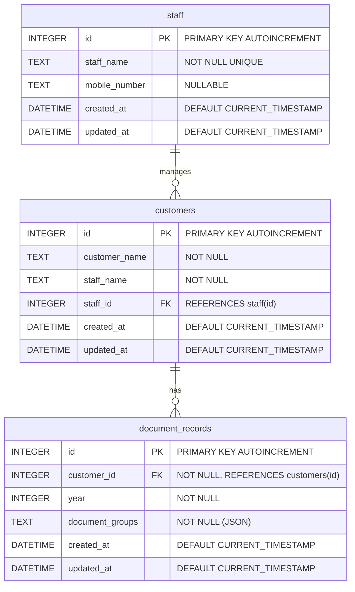

# ER図 - Required-documents-for-tax-return Backend

## ER図

## テーブル構造

### staff（担当者テーブル）

| カラム名 | 型 | 制約 |
|---------|-----|------|
| id | INTEGER | PRIMARY KEY, AUTOINCREMENT |
| staff_name | TEXT | NOT NULL, UNIQUE |
| mobile_number | TEXT |  |
| created_at | DATETIME | DEFAULT CURRENT_TIMESTAMP |
| updated_at | DATETIME | DEFAULT CURRENT_TIMESTAMP |

### customers（顧客テーブル）

| カラム名 | 型 | 制約 |
|---------|-----|------|
| id | INTEGER | PRIMARY KEY, AUTOINCREMENT |
| customer_name | TEXT | NOT NULL |
| staff_name | TEXT | NOT NULL (レガシー互換用) |
| staff_id | INTEGER | FK → staff(id) |
| created_at | DATETIME | DEFAULT CURRENT_TIMESTAMP |
| updated_at | DATETIME | DEFAULT CURRENT_TIMESTAMP |

**ユニーク制約**: `(customer_name, staff_name)`
**外部キー**: `staff_id` → `staff(id)` (ON DELETE SET NULL)

### document_records（年度別書類データテーブル）

| カラム名 | 型 | 制約 |
|---------|-----|------|
| id | INTEGER | PRIMARY KEY, AUTOINCREMENT |
| customer_id | INTEGER | NOT NULL, FK → customers(id) |
| year | INTEGER | NOT NULL |
| document_groups | TEXT | NOT NULL (JSON形式で保存) |
| created_at | DATETIME | DEFAULT CURRENT_TIMESTAMP |
| updated_at | DATETIME | DEFAULT CURRENT_TIMESTAMP |

**外部キー**: `customer_id` → `customers(id)` (ON DELETE CASCADE)

**ユニーク制約**: `(customer_id, year)`

## リレーションシップ

- **staff : customers = 1 : N**
    - 担当者1人に対して複数の顧客を担当
- **customers : document_records = 1 : N**
    - 1人の顧客に対して複数年度の書類データを保存可能
    - 顧客削除時は関連する書類データも連動削除（CASCADE）
