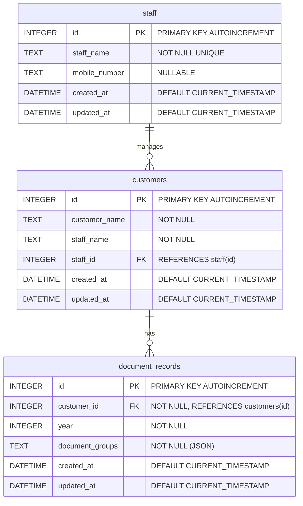

# ER図 - Required-documents-for-tax-return Backend

## ER図



## テーブル構造

### staff（担当者テーブル）

| カラム名 | 型 | 制約 |
|---------|-----|------|
| id | INTEGER | PRIMARY KEY, AUTOINCREMENT |
| staff_name | TEXT | NOT NULL, UNIQUE |
| mobile_number | TEXT |  |
| created_at | DATETIME | DEFAULT CURRENT_TIMESTAMP |
| updated_at | DATETIME | DEFAULT CURRENT_TIMESTAMP |

### customers（顧客テーブル）

| カラム名 | 型 | 制約 |
|---------|-----|------|
| id | INTEGER | PRIMARY KEY, AUTOINCREMENT |
| customer_name | TEXT | NOT NULL |
| staff_name | TEXT | NOT NULL (レガシー互換用) |
| staff_id | INTEGER | FK → staff(id) |
| created_at | DATETIME | DEFAULT CURRENT_TIMESTAMP |
| updated_at | DATETIME | DEFAULT CURRENT_TIMESTAMP |

**ユニーク制約**: `(customer_name, staff_name)`
**外部キー**: `staff_id` → `staff(id)` (ON DELETE SET NULL)

### document_records（年度別書類データテーブル）

| カラム名 | 型 | 制約 |
|---------|-----|------|
| id | INTEGER | PRIMARY KEY, AUTOINCREMENT |
| customer_id | INTEGER | NOT NULL, FK → customers(id) |
| year | INTEGER | NOT NULL |
| document_groups | TEXT | NOT NULL (JSON形式で保存) |
| created_at | DATETIME | DEFAULT CURRENT_TIMESTAMP |
| updated_at | DATETIME | DEFAULT CURRENT_TIMESTAMP |

**外部キー**: `customer_id` → `customers(id)` (ON DELETE CASCADE)

**ユニーク制約**: `(customer_id, year)`

## インデックス

| インデックス名 | テーブル | カラム | 用途 |
|---------------|---------|--------|------|
| `idx_customers_staff_id` | customers | staff_id | 担当者による顧客フィルタ |
| `idx_customers_staff_name` | customers | staff_name | レガシー互換の担当者名検索 |
| `idx_document_records_customer_id` | document_records | customer_id | 顧客の書類データ取得 |
| `idx_document_records_year` | document_records | year | 年度による書類データ検索 |

## リレーションシップ

- **staff : customers = 1 : N**
    - 担当者1人に対して複数の顧客を担当
    - `staff_id` が `ON DELETE SET NULL` のため、担当者削除時は顧客の紐付けが解除される
    - ただしアプリ側で紐付き顧客がいる場合は削除を拒否
- **customers : document_records = 1 : N**
    - 1人の顧客に対して複数年度の書類データを保存可能
    - 顧客削除時は関連する書類データも連動削除（`ON DELETE CASCADE`）

## データベース設定

| 設定 | 値 | 説明 |
|------|-----|------|
| journal_mode | WAL | 読み取り/書き込みの並行実行を可能にし、パフォーマンス向上 |
| foreign_keys | ON | 外部キー制約を有効化（SQLiteはデフォルト無効） |

## document_groups JSON構造

`document_records.document_groups` はカテゴリ別書類リストをJSON形式で保存:

```json
[
  {
    "id": "category-uuid",
    "category": "基本資料",
    "documents": [
      {
        "id": "doc-uuid",
        "text": "本人確認書類",
        "checked": true,
        "subItems": [
          {
            "id": "sub-uuid",
            "text": "マイナンバーカード",
            "checked": false
          }
        ]
      }
    ]
  }
]
```

## マイグレーション

起動時に `initializeDb()` が自動実行し、以下のマイグレーションを冪等に適用:

1. **staff.mobile_number 追加** — 携帯電話番号カラム（既存テーブルへのALTER TABLE）
2. **customers.staff_id 追加** — 担当者テーブルへの外部キー（既存の `staff_name` からIDを自動解決）
