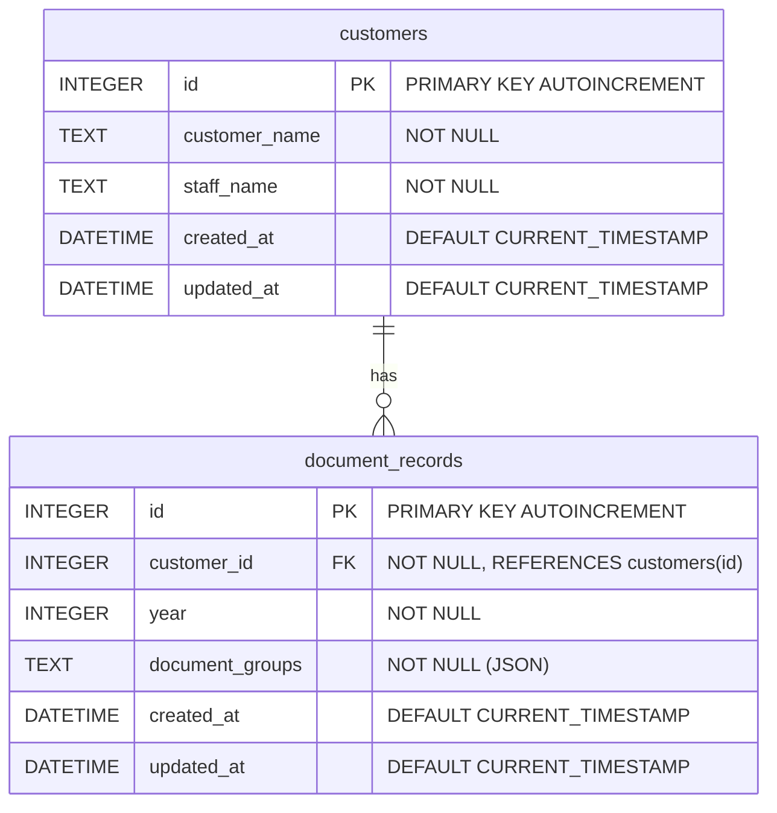

# ER図 - Required-documents-for-tax-return Backend

## ER図

## テーブル構造

### customers（顧客テーブル）

| カラム名 | 型 | 制約 |
|---------|-----|------|
| id | INTEGER | PRIMARY KEY, AUTOINCREMENT |
| customer_name | TEXT | NOT NULL |
| staff_name | TEXT | NOT NULL |
| created_at | DATETIME | DEFAULT CURRENT_TIMESTAMP |
| updated_at | DATETIME | DEFAULT CURRENT_TIMESTAMP |

**ユニーク制約**: `(customer_name, staff_name)`

### document_records（年度別書類データテーブル）

| カラム名 | 型 | 制約 |
|---------|-----|------|
| id | INTEGER | PRIMARY KEY, AUTOINCREMENT |
| customer_id | INTEGER | NOT NULL, FK → customers(id) |
| year | INTEGER | NOT NULL |
| document_groups | TEXT | NOT NULL (JSON形式で保存) |
| created_at | DATETIME | DEFAULT CURRENT_TIMESTAMP |
| updated_at | DATETIME | DEFAULT CURRENT_TIMESTAMP |

**外部キー**: `customer_id` → `customers(id)` (ON DELETE CASCADE)

**ユニーク制約**: `(customer_id, year)`

## リレーションシップ

- **customers : document_records = 1 : N**
- 1人の顧客に対して複数年度の書類データを保存可能
- 顧客削除時は関連する書類データも連動削除（CASCADE）
