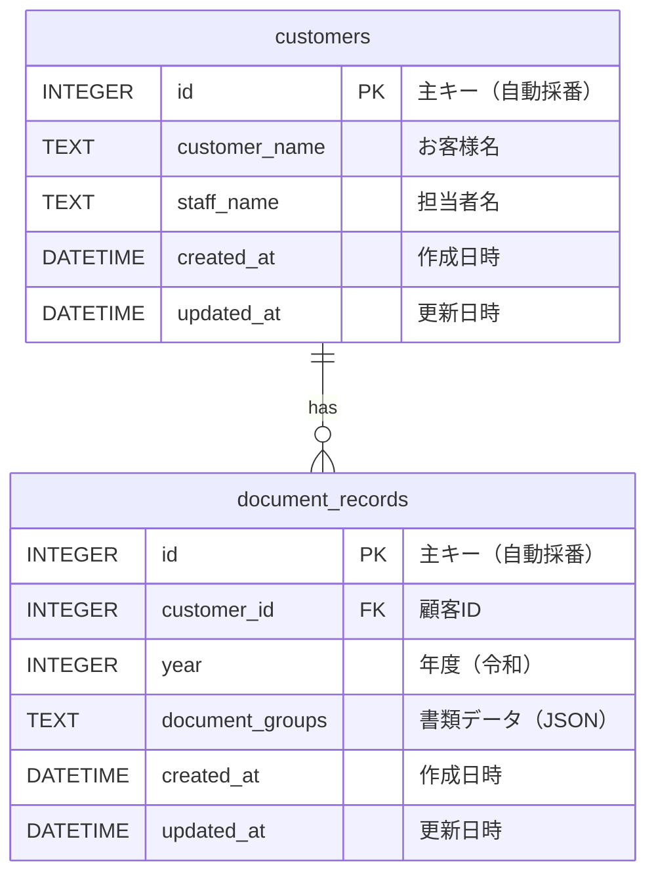

# 確定申告必要書類管理システム ER図

## データベース構造



## テーブル詳細

### customers（顧客テーブル）

| カラム名 | 型 | 制約 | 説明 |
|---------|-----|------|------|
| id | INTEGER | PRIMARY KEY AUTOINCREMENT | 主キー |
| customer_name | TEXT | NOT NULL | お客様名 |
| staff_name | TEXT | NOT NULL | 担当者名 |
| created_at | DATETIME | DEFAULT CURRENT_TIMESTAMP | 作成日時 |
| updated_at | DATETIME | DEFAULT CURRENT_TIMESTAMP | 更新日時 |

**ユニーク制約**: `UNIQUE(customer_name, staff_name)`
- お客様名と担当者名の組み合わせで一意

### document_records（書類データテーブル）

| カラム名 | 型 | 制約 | 説明 |
|---------|-----|------|------|
| id | INTEGER | PRIMARY KEY AUTOINCREMENT | 主キー |
| customer_id | INTEGER | NOT NULL, FOREIGN KEY | 顧客ID |
| year | INTEGER | NOT NULL | 年度（令和年） |
| document_groups | TEXT | NOT NULL | 書類データ（JSON形式） |
| created_at | DATETIME | DEFAULT CURRENT_TIMESTAMP | 作成日時 |
| updated_at | DATETIME | DEFAULT CURRENT_TIMESTAMP | 更新日時 |

**外部キー制約**: `FOREIGN KEY (customer_id) REFERENCES customers(id) ON DELETE CASCADE`
- 顧客が削除されると関連する書類データも削除

**ユニーク制約**: `UNIQUE(customer_id, year)`
- 顧客と年度の組み合わせで一意

## リレーション

```
customers (1) ──────< (N) document_records
```

- 1人の顧客（customers）は複数の年度の書類データ（document_records）を持つことができる
- 各書類データは必ず1人の顧客に紐づく

## document_groups JSONの構造

```typescript
interface CategoryGroup {
  id: string;           // カテゴリID
  category: string;     // カテゴリ名
  documents: DocumentItem[];
  note?: string;        // 備考
}

interface DocumentItem {
  id: string;           // 書類ID
  text: string;         // 書類名
  checked: boolean;     // チェック状態
}
```

### JSON例

```json
[
  {
    "id": "cat-1",
    "category": "収入関係",
    "documents": [
      { "id": "doc-1", "text": "源泉徴収票", "checked": true },
      { "id": "doc-2", "text": "給与明細", "checked": false }
    ],
    "note": ""
  },
  {
    "id": "cat-2",
    "category": "控除関係",
    "documents": [
      { "id": "doc-3", "text": "生命保険料控除証明書", "checked": true }
    ]
  }
]
```

## インデックス

自動生成されるインデックス：
- `customers.id` (PRIMARY KEY)
- `document_records.id` (PRIMARY KEY)
- `customers(customer_name, staff_name)` (UNIQUE)
- `document_records(customer_id, year)` (UNIQUE)
