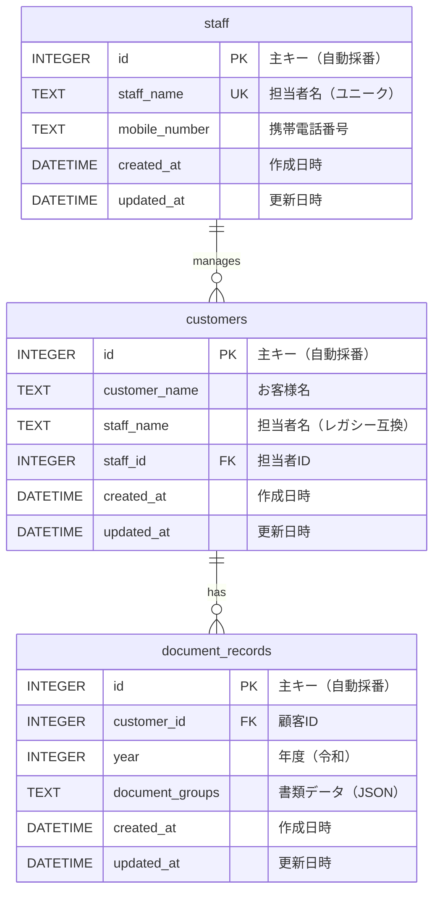

# 確定申告必要書類管理システム ER図

> 詳細な仕様は [backend/ER図.md](../backend/ER図.md) を参照してください。

## データベース構造



## テーブル詳細

### staff（担当者テーブル）

| カラム名 | 型 | 制約 | 説明 |
|---------|-----|------|------|
| id | INTEGER | PRIMARY KEY AUTOINCREMENT | 主キー |
| staff_name | TEXT | NOT NULL, UNIQUE | 担当者名 |
| mobile_number | TEXT | | 携帯電話番号 |
| created_at | DATETIME | DEFAULT CURRENT_TIMESTAMP | 作成日時 |
| updated_at | DATETIME | DEFAULT CURRENT_TIMESTAMP | 更新日時 |

### customers（顧客テーブル）

| カラム名 | 型 | 制約 | 説明 |
|---------|-----|------|------|
| id | INTEGER | PRIMARY KEY AUTOINCREMENT | 主キー |
| customer_name | TEXT | NOT NULL | お客様名 |
| staff_name | TEXT | NOT NULL | 担当者名（レガシー互換用） |
| staff_id | INTEGER | FK → staff(id) | 担当者ID |
| created_at | DATETIME | DEFAULT CURRENT_TIMESTAMP | 作成日時 |
| updated_at | DATETIME | DEFAULT CURRENT_TIMESTAMP | 更新日時 |

**ユニーク制約**: `UNIQUE(customer_name, staff_name)`
**外部キー**: `staff_id` → `staff(id)` (ON DELETE SET NULL)

### document_records（書類データテーブル）

| カラム名 | 型 | 制約 | 説明 |
|---------|-----|------|------|
| id | INTEGER | PRIMARY KEY AUTOINCREMENT | 主キー |
| customer_id | INTEGER | NOT NULL, FOREIGN KEY | 顧客ID |
| year | INTEGER | NOT NULL | 年度（令和年） |
| document_groups | TEXT | NOT NULL | 書類データ（JSON形式） |
| created_at | DATETIME | DEFAULT CURRENT_TIMESTAMP | 作成日時 |
| updated_at | DATETIME | DEFAULT CURRENT_TIMESTAMP | 更新日時 |

**外部キー制約**: `FOREIGN KEY (customer_id) REFERENCES customers(id) ON DELETE CASCADE`
**ユニーク制約**: `UNIQUE(customer_id, year)`

## リレーション

```
staff (1) ──────< (N) customers (1) ──────< (N) document_records
```

- 1人の担当者は複数の顧客を担当（担当者削除時は紐付け解除）
- 1人の顧客は複数年度の書類データを持つ（顧客削除時は連動削除）

## インデックス

| インデックス名 | テーブル | カラム | 用途 |
|---------------|---------|--------|------|
| idx_customers_staff_id | customers | staff_id | 担当者による顧客フィルタ |
| idx_customers_staff_name | customers | staff_name | レガシー互換の担当者名検索 |
| idx_document_records_customer_id | document_records | customer_id | 顧客の書類データ取得 |
| idx_document_records_year | document_records | year | 年度による書類データ検索 |

## document_groups JSONの構造

```typescript
interface CategoryGroup {
  id: string;           // カテゴリID
  category: string;     // カテゴリ名
  documents: DocumentItem[];
  note?: string;        // 備考
}

interface DocumentItem {
  id: string;           // 書類ID
  text: string;         // 書類名
  checked: boolean;     // チェック状態
  subItems: SubItem[];  // 中項目
}

interface SubItem {
  id: string;           // 中項目ID
  text: string;         // 中項目名
  checked: boolean;     // チェック状態
}
```

### JSON例

```json
[
  {
    "id": "cat-1",
    "category": "収入関係",
    "documents": [
      {
        "id": "doc-1",
        "text": "源泉徴収票",
        "checked": true,
        "subItems": [
          { "id": "sub-1", "text": "給与所得の源泉徴収票", "checked": false }
        ]
      },
      { "id": "doc-2", "text": "給与明細", "checked": false, "subItems": [] }
    ],
    "note": ""
  }
]
```
