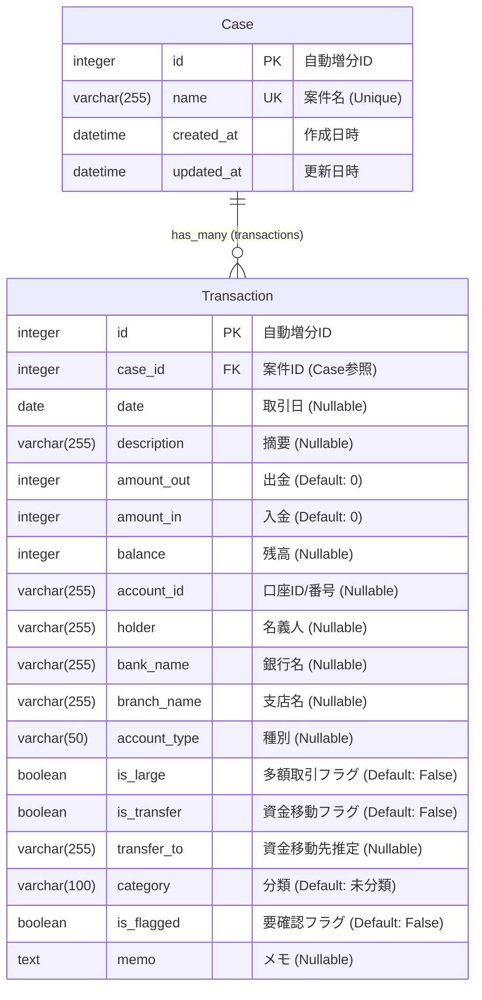

# Bank Analyzer データモデル詳細仕様書

## ER図 (Entity Relationship Diagram)

## テーブル詳細定義

### 1. Case (案件)
相続案件、または分析対象のプロジェクト単位を管理するテーブルです。

| カラム名 | データ型 | 制約 | 説明 |
| :--- | :--- | :--- | :--- |
| `id` | Integer | PK, Auto Increment | 主キー |
| `name` | Varchar(255) | Unique, Not Null | 案件名（被相続人名など）。重複不可。 |
| `created_at` | DateTime | Auto Now Add | 作成日時（自動設定） |
| `updated_at` | DateTime | Auto Now | 更新日時（自動更新） |

### 2. Transaction (取引明細)
インポートされた銀行取引データを1行ずつ管理する主要テーブルです。

| カラム名 | データ型 | 制約 | 説明 |
| :--- | :--- | :--- | :--- |
| `id` | Integer | PK, Auto Increment | 主キー |
| `case_id` | Integer | FK (Case), On Delete CASCADE | 所属する案件のID。案件削除時に連動して削除。 |
| `date` | Date | Nullable | 取引日。和暦等はインポート時に西暦へ変換済。 |
| `description` | Varchar(255) | Nullable | 摘要（取引内容）。 |
| `amount_out` | Integer | Default 0 | 払戻金額（出金）。ない場合は0。 |
| `amount_in` | Integer | Default 0 | お預り金額（入金）。ない場合は0。 |
| `balance` | Integer | Nullable | 差引残高。 |
| `account_id` | Varchar(255) | Nullable | 口座識別ID（口座番号や銀行名などから生成）。 |
| `holder` | Varchar(255) | Nullable | 口座名義人。 |
| `bank_name` | Varchar(255) | Nullable | 銀行名。 |
| `branch_name` | Varchar(255) | Nullable | 支店名。 |
| `account_type` | Varchar(50) | Nullable | 口座種別（普通預金等）。 |
| `is_large` | Boolean | Default False | 多額取引判定フラグ（設定閾値を超えた場合にTrue）。 |
| `is_transfer` | Boolean | Default False | 資金移動判定フラグ（別口座への移動と推定される場合にTrue）。 |
| `transfer_to` | Varchar(255) | Nullable | 移動先と推定される口座名などのメモ。 |
| `category` | Varchar(100) | Default '未分類' | AIまたはルールベースで判定された費目分類（生活費、贈与など）。 |
| `is_flagged` | Boolean | Default False | 要確認フラグ（付箋機能）。後で確認したい取引にマーク。 |
| `memo` | Text | Nullable | メモ。取引に対する備考や確認事項を記録。 |

## インデックス設計
パフォーマンス最適化のため、以下のインデックスが設定されています。
- `(case_id, date)`: 時系列表示、範囲検索用
- `(case_id, account_id)`: 口座ごとの絞り込み用
- `(category)`: 分類ごとの集計用
- `(case_id, is_flagged)`: 付箋付き取引の検索用
- `(case_id, category)`: 案件×分類の集計・フィルタ用
- `(case_id, is_large)`: 案件×多額取引の絞り込み用
- `(case_id, is_transfer)`: 案件×資金移動の絞り込み用
