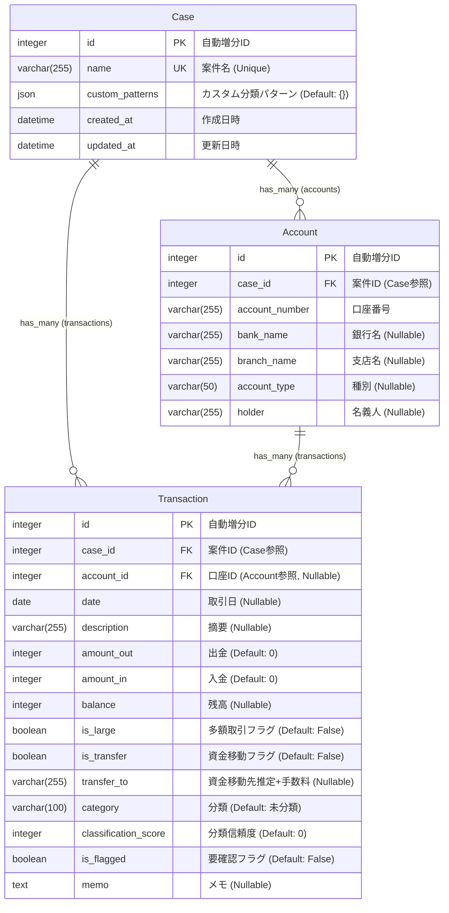

# Bank Analyzer データモデル詳細仕様書

## ER図 (Entity Relationship Diagram)


```mermaid
erDiagram
    Case ||--o{ Account : "has_many (accounts)"
    Case ||--o{ Transaction : "has_many (transactions)"
    Account ||--o{ Transaction : "has_many (transactions)"

    Case {
        integer id PK "自動増分ID"
        varchar(255) name UK "案件名 (Unique)"
        json custom_patterns "カスタム分類パターン (Default: {})"
        datetime created_at "作成日時"
        datetime updated_at "更新日時"
    }

    Account {
        integer id PK "自動増分ID"
        integer case_id FK "案件ID (Case参照)"
        varchar(255) account_number "口座番号"
        varchar(255) bank_name "銀行名 (Nullable)"
        varchar(255) branch_name "支店名 (Nullable)"
        varchar(50) account_type "種別 (Nullable)"
        varchar(255) holder "名義人 (Nullable)"
    }

    Transaction {
        integer id PK "自動増分ID"
        integer case_id FK "案件ID (Case参照)"
        integer account_id FK "口座ID (Account参照, Nullable)"
        date date "取引日 (Nullable)"
        varchar(255) description "摘要 (Nullable)"
        integer amount_out "出金 (Default: 0)"
        integer amount_in "入金 (Default: 0)"
        integer balance "残高 (Nullable)"
        boolean is_large "多額取引フラグ (Default: False)"
        boolean is_transfer "資金移動フラグ (Default: False)"
        varchar(255) transfer_to "資金移動先推定+手数料 (Nullable)"
        varchar(100) category "分類 (Default: 未分類)"
        integer classification_score "分類信頼度 (Default: 0)"
        boolean is_flagged "要確認フラグ (Default: False)"
        text memo "メモ (Nullable)"
    }
```

## テーブル詳細定義

### 1. Case (案件)
相続案件、または分析対象のプロジェクト単位を管理するテーブルです。

| カラム名 | データ型 | 制約 | 説明 |
| :--- | :--- | :--- | :--- |
| `id` | Integer | PK, Auto Increment | 主キー |
| `name` | Varchar(255) | Unique, Not Null | 案件名（被相続人名など）。重複不可。 |
| `custom_patterns` | JSON | Default {} | カスタム分類パターン。案件ごとの分類ルールを保存。 |
| `created_at` | DateTime | Auto Now Add | 作成日時（自動設定） |
| `updated_at` | DateTime | Auto Now | 更新日時（自動更新） |

### 2. Account (口座)
銀行口座情報を管理するテーブルです。Case と Transaction の間に位置し、口座情報の正規化を実現します。

| カラム名 | データ型 | 制約 | 説明 |
| :--- | :--- | :--- | :--- |
| `id` | Integer | PK, Auto Increment | 主キー |
| `case_id` | Integer | FK (Case), On Delete CASCADE | 所属する案件のID。 |
| `account_number` | Varchar(255) | Not Null | 口座番号。`(case_id, account_number)` で一意制約。 |
| `bank_name` | Varchar(255) | Nullable | 銀行名。 |
| `branch_name` | Varchar(255) | Nullable | 支店名。 |
| `account_type` | Varchar(50) | Nullable | 口座種別（普通預金等）。 |
| `holder` | Varchar(255) | Nullable | 口座名義人。 |

### 3. Transaction (取引明細)
インポートされた銀行取引データを1行ずつ管理する主要テーブルです。

| カラム名 | データ型 | 制約 | 説明 |
| :--- | :--- | :--- | :--- |
| `id` | Integer | PK, Auto Increment | 主キー |
| `case_id` | Integer | FK (Case), On Delete CASCADE | 所属する案件のID。案件削除時に連動して削除。 |
| `account_id` | Integer | FK (Account), On Delete CASCADE, Nullable | 所属する口座のID。口座削除時に連動して削除。 |
| `date` | Date | Nullable | 取引日。和暦等はインポート時に西暦へ変換済。 |
| `description` | Varchar(255) | Nullable | 摘要（取引内容）。 |
| `amount_out` | Integer | Default 0 | 払戻金額（出金）。ない場合は0。 |
| `amount_in` | Integer | Default 0 | お預り金額（入金）。ない場合は0。 |
| `balance` | Integer | Nullable | 差引残高。 |
| `is_large` | Boolean | Default False | 多額取引判定フラグ（設定閾値を超えた場合にTrue）。 |
| `is_transfer` | Boolean | Default False | 資金移動判定フラグ（別口座への移動と推定される場合にTrue）。 |
| `transfer_to` | Varchar(255) | Nullable | 移動先と推定される口座名・日付。振込手数料がある場合は「手数料XXX円」を付記（例: `7654321 (2025-01-11) 手数料550円`）。 |
| `category` | Varchar(100) | Default '未分類' | AIまたはルールベースで判定された費目分類（生活費、贈与など）。 |
| `classification_score` | Integer | Default 0 | 分類の信頼度スコア。 |
| `is_flagged` | Boolean | Default False | 要確認フラグ（付箋機能）。後で確認したい取引にマーク。 |
| `memo` | Text | Nullable | メモ。取引に対する備考や確認事項を記録。 |

## インデックス設計
パフォーマンス最適化のため、以下のインデックスが設定されています。

### Account テーブル
- `(case_id, account_number)`: 一意制約（UNIQUE）

### Transaction テーブル
- `(case_id, date)`: 時系列表示、範囲検索用
- `(case_id, account_id)`: 口座ごとの絞り込み用
- `(category)`: 分類ごとの集計用
- `(case_id, is_flagged)`: 付箋付き取引の検索用
- `(case_id, category)`: 案件×分類の集計・フィルタ用
- `(case_id, is_large)`: 案件×多額取引の絞り込み用
- `(case_id, is_transfer)`: 案件×資金移動の絞り込み用

## カスタムQuerySet

### TransactionQuerySet

`Transaction.objects` は `TransactionQuerySet` をマネージャーとして使用し、以下のカスタムメソッドを提供する。

| メソッド | 説明 |
| :--- | :--- |
| `with_account_info()` | `select_related('account')` + Account フィールド（`bank_name`, `branch_name`, `account_number`, `account_type`, `holder`）をアノテーションして返す。N+1クエリを防止し、DataFrame変換やテンプレート表示で使用。 |

```python
# 使用例: 口座情報付きで全取引を取得
transactions = case.transactions.with_account_info().order_by('date')
```

## 資金移動検出アルゴリズム

`analyze_transfers`（`analyzer/lib/analyzer.py`）で実行される。

### 判定条件
1. **異なる口座間**の取引であること
2. **金額が許容誤差内**で一致（デフォルト: 1,000円）
3. **日付が指定日数以内**（デフォルト: 3日以内）
   - `after_only`モード: 出金日 ≦ 入金日 ≦ 出金日+N日
   - `both`モード: |出金日 - 入金日| ≦ N日

### マッチング優先順位
複数の候補がある場合、以下の順で最適候補を選択:
1. **金額差が最小**のもの
2. **日付差が最小**のもの

### 振込手数料の推定
出金額 > 入金額の場合、差額を振込手数料として`transfer_to`フィールドに付記する。
