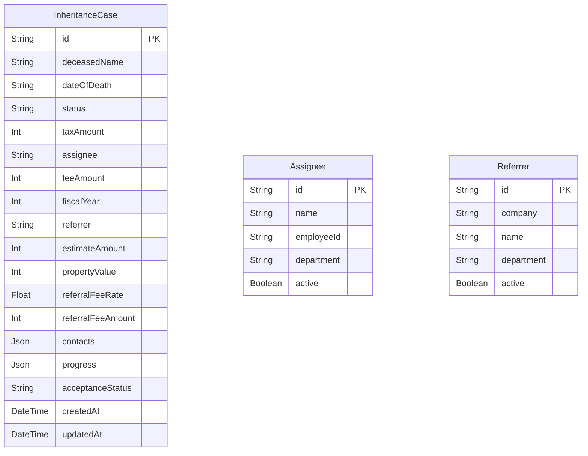

# Inheritance Tax Case Management API

相続税申告案件管理システムのバックエンドAPI

## 技術スタック

- **言語**: TypeScript
- **フレームワーク**: Express.js
- **ORM**: Prisma
- **データベース**: PostgreSQL

## プロジェクト構造

```
Back/
├── src/
│   ├── config/          # 設定ファイル
│   ├── controllers/     # コントローラー
│   ├── routes/          # ルート定義
│   ├── models/          # データモデル (Prisma)
│   ├── middleware/      # ミドルウェア
│   ├── types/           # TypeScript型定義
│   ├── utils/           # ユーティリティ関数
│   ├── app.ts           # Expressアプリケーション設定
│   └── server.ts        # サーバーエントリーポイント
├── prisma/
│   ├── migrations/      # データベースマイグレーション
│   └── schema.prisma    # Prismaスキーマ定義
├── dist/                # ビルド出力
├── .env                 # 環境変数
├── .env.example         # 環境変数テンプレート
├── tsconfig.json        # TypeScript設定
└── package.json         # 依存関係
```

## セットアップ

### 1. 依存関係のインストール

```bash
cd Back
npm install
```

### 2. 環境変数の設定

`.env.example`を`.env`にコピーして編集:

```bash
cp .env.example .env
```

### 3. データベースのセットアップ

```bash
# マイグレーションの実行
npx prisma migrate dev
```

### 4. 開発サーバーの起動

```bash
npm run dev
```

サーバーは `http://localhost:3001` で起動します。

## 利用可能なスクリプト

- `npm run dev` - 開発サーバーを起動（ホットリロード有効）
- `npm run build` - TypeScriptをコンパイル
- `npm start` - 本番用サーバーを起動
- `npm run watch` - TypeScriptをwatch modeでコンパイル

## API エンドポイント

### ヘルスチェック

- `GET /health` - サーバーの稼働状況を確認

### 相続税案件 (Cases)

- `GET /api/cases` - 全案件を取得
- `GET /api/cases/:id` - 特定案件を取得
- `POST /api/cases` - 新規案件を作成
- `PUT /api/cases/:id` - 案件を更新
- `DELETE /api/cases/:id` - 案件を削除

### 担当者 (Assignees)

- `GET /api/assignees` - 全担当者を取得
- `POST /api/assignees` - 新規担当者を作成
- `PUT /api/assignees/:id` - 担当者を更新
- `DELETE /api/assignees/:id` - 担当者を削除

### 紹介者 (Referrers)

- `GET /api/referrers` - 全紹介者を取得
- `POST /api/referrers` - 新規紹介者を作成
- `PUT /api/referrers/:id` - 紹介者を更新
- `DELETE /api/referrers/:id` - 紹介者を削除

### 今後追加予定

- 認証・認可機能
- 高度な検索・フィルタリング

## 開発状況

- [x] プロジェクトセットアップ
- [x] TypeScript + Express環境構築
- [x] データベース統合 (Prisma + PostgreSQL)
- [x] 基本的なAPIエンドポイント (Cases)
- [x] 担当者管理API (Assignees)
- [x] 紹介者管理API (Referrers)
- [ ] 認証・認可
- [ ] バリデーション
- [ ] テスト

## 環境変数

| 変数名 | 説明 | デフォルト値 |
|--------|------|-------------|
| PORT | サーバーポート | 3001 |
| NODE_ENV | 実行環境 | development |
| FRONTEND_URL | フロントエンドURL | http://localhost:3000 |
| DATABASE_URL | データベース接続URL | (必須) |

## ER Diagram


