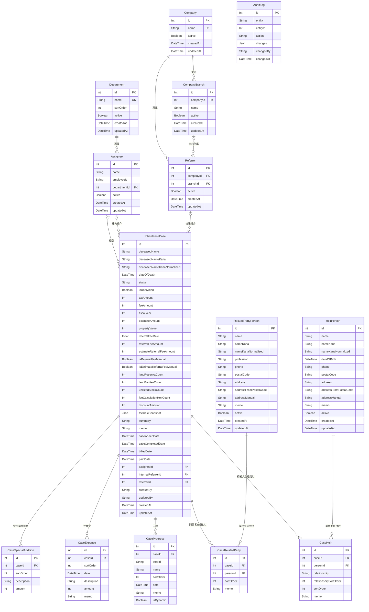

# 相続税申告案件管理 ER図

最終更新: 2026-06-20  
正本: [`web/prisma/schema.prisma`](web/prisma/schema.prisma)

## エンティティ関連図

## 関係と制約

| 親 | 子・参照元 | 関係 | 削除時 |
| --- | --- | --- | --- |
| `Department` | `Assignee.departmentId` | 部門1件に担当者0件以上 | `SetNull` |
| `Assignee` | `InheritanceCase.assigneeId` | 担当者1名が案件0件以上を担当 | `SetNull` |
| `Assignee` | `InheritanceCase.internalReferrerId` | 担当者1名が案件0件以上を社内紹介 | `SetNull` |
| `Company` | `CompanyBranch.companyId` | 会社1件に支店0件以上 | `Restrict` |
| `Company` | `Referrer.companyId` | 会社1件に社外紹介者0件以上 | `Restrict` |
| `CompanyBranch` | `Referrer.branchId` | 紹介者の支店は任意 | `SetNull` |
| `Referrer` | `InheritanceCase.referrerId` | 案件の社外紹介者は任意 | `SetNull` |
| `InheritanceCase` | 工程・立替金・特別業務報酬・人物中間テーブル | 案件1件に明細0件以上 | `Cascade` |
| `HeirPerson` | `CaseHeir.personId` | 相続人と案件は多対多 | `Restrict` |
| `RelatedPartyPerson` | `CaseRelatedParty.personId` | 関係者と案件は多対多 | `Restrict` |

## 補足

- `AuditLog.entityId`は複数種類のエンティティを記録するため、DB外部キーを設定していません。
- `CompanyBranch`は`companyId + name`、人物中間テーブルは`caseId + personId`で一意です。
- `feeCalculationHeirCount`は報酬計算の入力値であり、`CaseHeir`の紐付け人数とは別の業務値です。
- 紹介料額は非NULLで保持し、自動計算か手動上書きかを`isReferralFeeManual`と`isEstimateReferralFeeManual`で区別します。
- 案件ステータスの日付は`caseAddedDate`、`caseCompletedDate`、`billedDate`、`paidDate`に保持し、DB制約でステータスとの整合性を保証します。
- 相続人と関係者は役割固有項目と管理画面が異なるため、`HeirPerson`と`RelatedPartyPerson`に意図的に分離しています。
- 年計表は`paidDate`（入金日）を計上月として集計します。
- Mermaidの属性欄では任意項目も型名のみで表記しています。NULL可否・既定値・索引の正確な定義はPrismaスキーマを参照してください。
