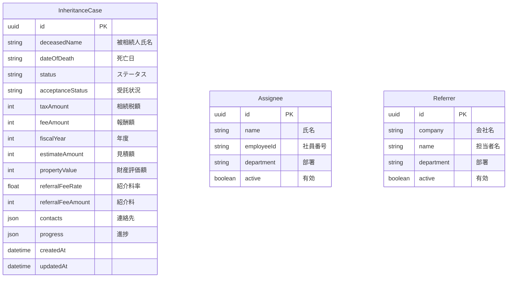

# 相続税案件管理システム

## 概要

相続税申告案件を管理するシステムです。案件の進捗管理、担当者・紹介者のマスタ管理機能を提供します。

## 技術スタック

| レイヤー | 技術 |
|---------|------|
| Frontend | Next.js 16, React 19, TypeScript, Tailwind CSS v4, TanStack Query/Table |
| Backend | Next.js API Routes, Prisma ORM 6, Zod |
| Database | PostgreSQL 16 |
| Infrastructure | Docker, Docker Compose |

## 機能

- **案件管理**: 相続税案件の CRUD、進捗管理、報酬計算
- **担当者管理**: 担当者のマスタ管理（一括保存機能）
- **紹介者管理**: 紹介者のマスタ管理（一括保存機能）
- **リアルタイムバリデーション**: Zod による入力検証

## ディレクトリ構成

```
inheritance-case-management/
├── .env                    # PostgreSQL認証情報
├── web/                    # Next.js（フロントエンド + API Routes）
│   ├── src/
│   │   ├── app/            # ページコンポーネント
│   │   │   ├── page.tsx            # 案件一覧
│   │   │   ├── [id]/               # 案件詳細
│   │   │   ├── new/                # 案件作成
│   │   │   ├── settings/           # マスタデータ管理
│   │   │   ├── analytics/          # ダッシュボード
│   │   │   └── api/                # API Routes（Next.js）
│   │   │       ├── health/         # ヘルスチェック
│   │   │       ├── cases/          # 案件CRUD
│   │   │       ├── assignees/      # 担当者CRUD
│   │   │       └── referrers/      # 紹介者CRUD
│   │   ├── components/     # UI コンポーネント
│   │   ├── hooks/          # カスタムフック
│   │   ├── lib/            # Prisma, ユーティリティ, CRUDファクトリ
│   │   └── types/          # Zodバリデーションスキーマ
│   ├── prisma/             # データベーススキーマ
│   ├── Dockerfile          # マルチステージビルド
│   └── package.json
├── docker-compose.yml      # 本番用（PostgreSQL + Web）
├── docker-compose.dev.yml  # 開発用
└── docker-compose.prod.yml # 本番オーバーライド
```

## クイックスタート

### 前提条件

- Docker & Docker Compose

### 開発環境の起動

```bash
# 1. 環境変数を設定
cp .env.example .env

# 2. 開発環境を起動
docker compose -f docker-compose.dev.yml up --build

# 3. ブラウザでアクセス
# Web + API: http://localhost:3020
```

### 本番環境の起動

```bash
docker compose up --build -d
```

> **Note**: `manage.bat start` で全アプリを起動する場合は、Nginx Gateway 経由で http://localhost/itcm/ からアクセスできます。

## ポート設定

| サービス | ポート | URL |
|---------|--------|-----|
| Web + API | 3020 | http://localhost:3020 |
| PostgreSQL | 3022 | localhost:3022 |

## API エンドポイント

| メソッド | パス | 説明 |
|---------|------|------|
| GET | /api/cases | 案件一覧取得 |
| GET | /api/cases/:id | 案件詳細取得 |
| POST | /api/cases | 案件作成 |
| PUT | /api/cases/:id | 案件更新 |
| DELETE | /api/cases/:id | 案件削除 |
| GET | /api/assignees | 担当者一覧 |
| GET | /api/referrers | 紹介者一覧 |
| GET | /health | ヘルスチェック |

## データベーススキーマ



## 開発コマンド

```bash
# コンテナに入ってコマンド実行
docker exec -it itcm-dev-web sh

# Prisma Studio（DB GUI）
docker exec -it itcm-dev-web npx prisma studio

# ログ確認
docker compose -f docker-compose.dev.yml logs -f web

# コンテナ停止
docker compose -f docker-compose.dev.yml down

# データも含めて削除
docker compose -f docker-compose.dev.yml down -v
```
