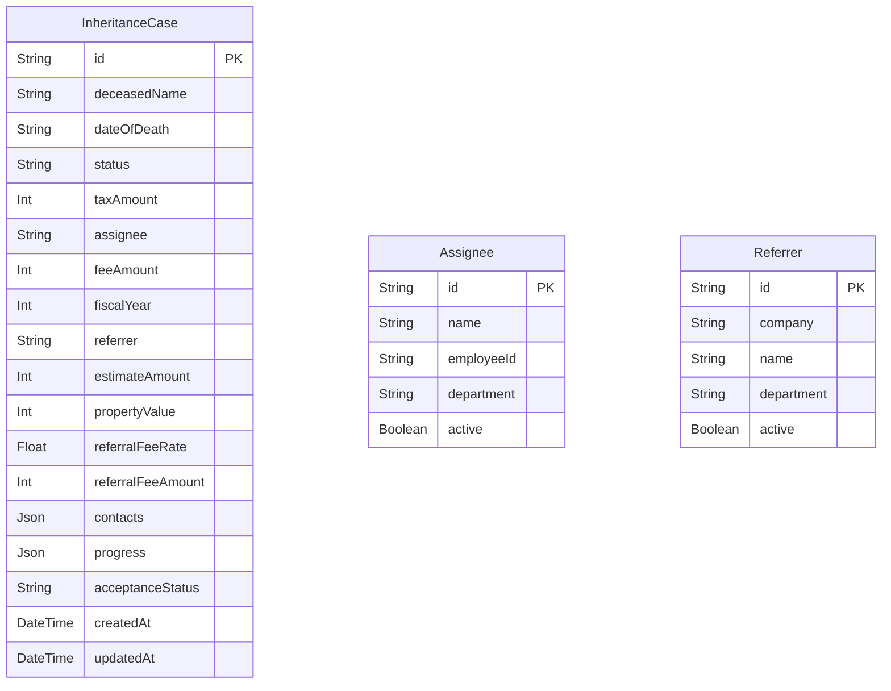

# Inheritance Tax Case Management System

## Overview
This is a case management system for inheritance tax calculations. It consists of a Next.js frontend and a Node.js/Express backend, using PostgreSQL as the database.

## Features
- **Case Management**: Create, Read, Update, Delete for inheritance tax cases.
- **Assignee Management**: Manage staff assignees with **Batch Save** functionality (modifications are drafted locally and saved in bulk).
- **Referrer Management**: Manage referrers case sources with **Batch Save** functionality.
- **Dockerized Environment**: Fully containerized setup for production-like deployment.

## Architecture
- **Frontend**: Next.js (React), TypeScript, Tailwind CSS
- **Backend**: Node.js, Express, TypeScript, Prisma ORM
- **Database**: PostgreSQL

## Prerequisites
- Docker & Docker Compose
- Node.js (v20+) (for local dev)

## Setup & Running (Production Docker)

1.  **Clone the repository**
2.  **Start the application**
    ```bash
    docker-compose -f docker-compose.prod.yml up -d --build
    ```
    *Note: The database migrations will run automatically on container startup.*

## Ports Configuration
The application uses the following ports in the production setup:

| Service | Container Port | Host Port | URL |
|---------|----------------|-----------|-----|
| Frontend| 3000           | 3020      | http://localhost:3020 |
| Backend | 3001           | 3021      | http://localhost:3021 |
| Database| 5432           | 3022      | postgres://localhost:3022 |

## ER Diagram



## Development

### Frontend
```bash
cd Front
npm install
npm run dev
```
Access at: http://localhost:3000

### Backend
```bash
cd Back
npm install
# Set up .env with DATABASE_URL
npm run dev
```
Access at: http://localhost:3001

