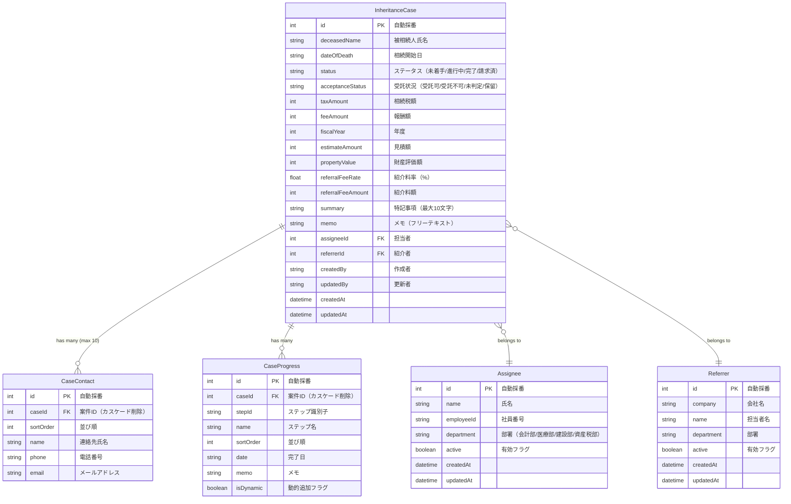

# 相続税案件管理システム

## 概要

相続税申告案件を管理するシステムです。案件の進捗管理、担当者・紹介者のマスタ管理、経営分析ダッシュボード、CSV取込・出力機能を提供します。

## 技術スタック

| レイヤー | 技術 |
|---------|------|
| Frontend | Next.js 16.1.1, React 19.2.3, TypeScript 5.9.3, Tailwind CSS v4 |
| Data | TanStack Query 5.64, TanStack Table 8.21, react-currency-input-field, @dnd-kit |
| Backend | Next.js API Routes, Prisma 6.2, Zod 3.24 |
| Database | PostgreSQL 16 |
| Other | @react-pdf/renderer, lucide-react, @radix-ui/react-label |
| Infrastructure | Docker, Docker Compose |

## 機能

### 案件管理（CRUD）

- 相続税案件の作成・閲覧・編集・削除
- ステータス管理: 未着手 / 進行中 / 完了 / 請求済
- 受託状況管理: 受託可 / 受託不可 / 未判定 / 保留
- 受託状況とステータスの連動ルール:
  - 未判定・保留 → ステータスは「未着手」のみ選択可
  - 受託不可 → ステータスは自動的に「完了」に設定
  - 受託可 → 全ステータス（未着手/進行中/完了/請求済）を選択可
- 担当者・紹介者のリレーション（FK）
- 報酬・見積・財産評価額・紹介料（率/額）の管理
- 特記事項（10文字以内の短い概要）・メモ（フリーテキスト）の管理
- 申告期限の自動計算（死亡日 + 10ヶ月）

### 進捗管理

- 8段階の進捗ステップをタイムラインUIで管理
- 各ステップに完了日・メモを記録
- 訪問ステップの動的追加・削除・再番号付け（isDynamic）
- ドラッグ&ドロップで工程の並べ替え（@dnd-kit）
- チェックボックスで複数工程を選択し、今日の日付を一括設定
- 一覧画面からモーダルで進捗日付をクイック編集
- 一覧画面の進捗列に最終完了工程名を表示

### 連絡先管理

- 案件ごとに最大10件の連絡先（氏名・電話番号・メール）を管理
- 並び順の保持（sortOrder）

### マスタ管理

- **担当者**: 社員番号（3桁）、部署（会計部/医療部/建設部/資産税部）、氏名
- **紹介者**: 会社名、部署、担当者名
- 一括編集・一括保存、ソフトデリート（active フラグ）

### 経営分析ダッシュボード（3タブ）

- **概要**: 年度別売上合計、完了/進行中件数、純売上（紹介料控除後）、前年比較
- **内訳**: 部署別・担当者別の売上/件数ランキング
- **紹介者**: 紹介者別実績ランキング（報酬総額/件数、ソート可能）
- 年度セレクターで全年度/特定年度を切替

### CSV取込・出力

- 案件データのCSVエクスポート
- CSVインポートによる一括登録・更新（バリデーション付き）

### KPIダッシュボード

- 案件総数 / 進行中 / 期限間近（30日以内）/ 当月完了の4指標をカード表示

### UI/UX

- **ステータスバッジ**: 案件ステータス（灰/青/緑/紫）、受託状況（緑/赤/灰/琥珀）を色付きバッジで表示
- **期限インジケーター**: 期限切れ（赤）/ 期限間近（琥珀）を視覚的に警告
- **進捗タイムライン**: 縦タイムラインUI（完了=緑ドット、未完了=グレードット）
- **インライン編集**: 一覧画面で特記事項をクリックして即時編集・保存
- **フィルターチップ**: 適用中のフィルターをチップ表示し、個別に解除可能
- **キーボードナビゲーション**: テーブル行の矢印キー移動・Enterで詳細遷移
- **スティッキーアクションバー**: 保存/キャンセル/削除ボタンがスクロール時も表示
- **折りたたみセクション**: フォーム各セクションの展開/折りたたみ
- **ローディングスケルトン**: データ取得中のプレースホルダーUI
- **トースト通知**: 成功/エラー/警告メッセージ
- **空状態メッセージ**: 検索結果なし時の案内表示
- **モーダルダイアログ**: CSV取込、進捗編集、確認ダイアログ

## ページ構成

| パス | 内容 |
|------|------|
| `/` | 案件一覧（KPI + フィルター + テーブル + ページネーション） |
| `/new` | 新規案件登録 |
| `/[id]` | 案件詳細編集（基本情報/金額/進捗/連絡先の4セクション） |
| `/settings` | 設定メニュー |
| `/settings/assignees` | 担当者マスタ管理 |
| `/settings/referrers` | 紹介者マスタ管理 |
| `/analytics` | 経営分析ダッシュボード（概要/内訳/紹介者の3タブ） |

## ディレクトリ構成

```
inheritance-case-management/
├── .env                        # PostgreSQL認証情報
├── docker-compose.yml          # 本番用（PostgreSQL + Web）
├── docker-compose.dev.yml      # 開発用
├── docker-compose.prod.yml     # 本番オーバーライド
└── web/                        # Next.js（フロントエンド + API Routes）
    ├── Dockerfile              # マルチステージビルド（dev/builder/runner）
    ├── Dockerfile.dev
    ├── docker-entrypoint.sh
    ├── package.json
    ├── next.config.ts          # basePath: /itcm
    ├── prisma/
    │   └── schema.prisma       # DBスキーマ（5モデル）
    └── src/
        ├── app/
        │   ├── page.tsx                # 案件一覧
        │   ├── columns.tsx             # TanStack Table カラム定義
        │   ├── data-table.tsx          # DataTable コンポーネント
        │   ├── FilterBar.tsx           # フィルターUI
        │   ├── KPICards.tsx            # KPI指標カード
        │   ├── Pagination.tsx          # ページネーション
        │   ├── InlineSummaryCell.tsx    # 特記事項インライン編集セル
        │   ├── ProgressModal.tsx       # 進捗クイック編集モーダル（D&D対応）
        │   ├── new/page.tsx            # 新規案件登録
        │   ├── [id]/                   # 案件詳細
        │   │   ├── page.tsx
        │   │   ├── edit-case-form.tsx  # メインフォーム
        │   │   ├── BasicInfoSection.tsx
        │   │   ├── FinancialSection.tsx
        │   │   ├── ProgressEditor.tsx  # タイムライン進捗UI（D&D対応）
        │   │   └── ContactListEditor.tsx
        │   ├── settings/               # マスタ管理
        │   │   ├── page.tsx
        │   │   ├── assignees/page.tsx
        │   │   └── referrers/page.tsx
        │   ├── analytics/              # 経営分析
        │   │   ├── page.tsx
        │   │   ├── OverviewTab.tsx
        │   │   ├── BreakdownTab.tsx
        │   │   ├── ReferrerTab.tsx
        │   │   └── RankingTable.tsx
        │   └── api/                    # API Routes
        │       ├── health/route.ts
        │       ├── cases/
        │       │   ├── route.ts        # GET（一覧+フィルタ）, POST（作成）
        │       │   └── [id]/route.ts   # GET, PUT, DELETE
        │       ├── assignees/
        │       │   ├── route.ts
        │       │   ├── handlers.ts     # ファクトリベースCRUD
        │       │   └── [id]/route.ts
        │       └── referrers/
        │           ├── route.ts
        │           ├── handlers.ts
        │           └── [id]/route.ts
        ├── components/
        │   ├── AppHeader.tsx           # ヘッダーナビゲーション
        │   ├── ClientLayout.tsx        # QueryClient + Toast プロバイダー
        │   ├── ImportCSVModal.tsx       # CSV取込ダイアログ
        │   ├── MasterListPage.tsx      # マスタ編集UI（共通）
        │   └── ui/                     # 汎用UIコンポーネント
        │       ├── Button.tsx
        │       ├── CollapsibleSection.tsx
        │       ├── CurrencyField.tsx
        │       ├── EmptyState.tsx
        │       ├── ErrorDisplay.tsx
        │       ├── Input.tsx / Label.tsx
        │       ├── Modal.tsx
        │       ├── SelectField.tsx
        │       ├── Skeleton.tsx
        │       ├── SortableHeader.tsx
        │       ├── StatusBadge.tsx
        │       ├── SetTodayButton.tsx
        │       ├── StickyActionBar.tsx
        │       ├── Toast.tsx
        │       └── table.tsx           # TanStack Table ラッパー
        ├── hooks/
        │   ├── use-cases.ts            # 案件一覧クエリ（TanStack Query）
        │   ├── use-master-list.ts      # マスタ編集ステート管理
        │   ├── use-progress-steps.ts   # 進捗チェック・D&D・一括日付設定
        │   ├── use-export-csv.ts       # CSVエクスポート
        │   ├── use-import-csv.ts       # CSVインポート
        │   ├── use-keyboard-navigation.ts
        │   └── use-error-handler.ts
        ├── lib/
        │   ├── prisma.ts               # Prisma クライアントシングルトン
        │   ├── prisma-utils.ts
        │   ├── api-error-handler.ts    # 統一エラーレスポンス
        │   ├── create-crud-route-handlers.ts  # CRUD APIルートファクトリ
        │   ├── analytics-utils.ts      # 集計・ランキングロジック
        │   ├── kpi-utils.ts            # KPI計算
        │   ├── deadline-utils.ts       # 申告期限計算（死亡日+10ヶ月）
        │   ├── progress-utils.ts       # 訪問ステップ追加/削除
        │   ├── export-csv.ts / import-csv.ts
        │   ├── utils.ts
        │   └── api/                    # クライアントサイドAPI
        │       ├── client.ts           # fetchラッパー（baseURL: /itcm/api）
        │       ├── cases.ts
        │       ├── assignees.ts
        │       ├── referrers.ts
        │       ├── crud-factory.ts     # 汎用CRUDクライアントファクトリ
        │       └── index.ts
        └── types/
            ├── shared.ts               # TypeScript型定義
            ├── validation.ts           # Zodバリデーションスキーマ
            └── constants.ts            # UI定数（ステータス色、ソート、年度等）
```

## API エンドポイント

### 案件 `/api/cases`

| メソッド | パス | 説明 |
|---------|------|------|
| GET | `/api/cases` | 案件一覧取得（ページネーション・フィルタ・ソート） |
| POST | `/api/cases` | 案件作成（連絡先・進捗含む） |
| GET | `/api/cases/:id` | 案件詳細取得（リレーション含む） |
| PUT | `/api/cases/:id` | 案件更新（連絡先・進捗の洗い替え） |
| DELETE | `/api/cases/:id` | 案件削除（連絡先・進捗もカスケード削除） |

**GET /api/cases クエリパラメータ:**

| パラメータ | 型 | 説明 |
|-----------|-----|------|
| page | int | ページ番号（デフォルト: 1） |
| pageSize | int | 1ページあたりの件数（デフォルト: 30） |
| status | string | ステータスフィルタ（未着手/進行中/完了/請求済） |
| acceptanceStatus | string | 受託状況フィルタ（受託可/受託不可/未判定/保留） |
| fiscalYear | int | 年度フィルタ |
| assigneeId | int | 担当者フィルタ |
| search | string | 被相続人氏名の部分一致検索 |
| sortBy | string | ソートキー（createdAt/dateOfDeath/deceasedName/fiscalYear/taxAmount/feeAmount等） |
| sortOrder | string | ソート順（asc/desc） |

### 担当者 `/api/assignees`

| メソッド | パス | 説明 |
|---------|------|------|
| GET | `/api/assignees` | 担当者一覧 |
| POST | `/api/assignees` | 担当者作成 |
| GET | `/api/assignees/:id` | 担当者取得 |
| PUT | `/api/assignees/:id` | 担当者更新 |
| DELETE | `/api/assignees/:id` | 担当者削除 |

### 紹介者 `/api/referrers`

| メソッド | パス | 説明 |
|---------|------|------|
| GET | `/api/referrers` | 紹介者一覧 |
| POST | `/api/referrers` | 紹介者作成 |
| GET | `/api/referrers/:id` | 紹介者取得 |
| PUT | `/api/referrers/:id` | 紹介者更新 |
| DELETE | `/api/referrers/:id` | 紹介者削除 |

### その他

| メソッド | パス | 説明 |
|---------|------|------|
| GET | `/api/health` | ヘルスチェック |

## データベーススキーマ


```mermaid
erDiagram
    InheritanceCase ||--o{ CaseContact : "has many (max 10)"
    InheritanceCase ||--o{ CaseProgress : "has many"
    InheritanceCase }o--|| Assignee : "belongs to"
    InheritanceCase }o--|| Referrer : "belongs to"

    InheritanceCase {
        int id PK "自動採番"
        string deceasedName "被相続人氏名"
        string dateOfDeath "相続開始日"
        string status "ステータス（未着手/進行中/完了/請求済）"
        string acceptanceStatus "受託状況（受託可/受託不可/未判定/保留）"
        int taxAmount "相続税額"
        int feeAmount "報酬額"
        int fiscalYear "年度"
        int estimateAmount "見積額"
        int propertyValue "財産評価額"
        float referralFeeRate "紹介料率（%）"
        int referralFeeAmount "紹介料額"
        string summary "特記事項（最大10文字）"
        string memo "メモ（フリーテキスト）"
        int assigneeId FK "担当者"
        int referrerId FK "紹介者"
        string createdBy "作成者"
        string updatedBy "更新者"
        datetime createdAt
        datetime updatedAt
    }

    Assignee {
        int id PK "自動採番"
        string name "氏名"
        string employeeId "社員番号"
        string department "部署（会計部/医療部/建設部/資産税部）"
        boolean active "有効フラグ"
        datetime createdAt
        datetime updatedAt
    }

    Referrer {
        int id PK "自動採番"
        string company "会社名"
        string name "担当者名"
        string department "部署"
        boolean active "有効フラグ"
        datetime createdAt
        datetime updatedAt
    }

    CaseContact {
        int id PK "自動採番"
        int caseId FK "案件ID（カスケード削除）"
        int sortOrder "並び順"
        string name "連絡先氏名"
        string phone "電話番号"
        string email "メールアドレス"
    }

    CaseProgress {
        int id PK "自動採番"
        int caseId FK "案件ID（カスケード削除）"
        string stepId "ステップ識別子"
        string name "ステップ名"
        int sortOrder "並び順"
        string date "完了日"
        string memo "メモ"
        boolean isDynamic "動的追加フラグ"
    }
```

## 設計パターン

- **CRUDルートファクトリ**: `createCrudRouteHandlers()` で担当者・紹介者のAPIルートを共通生成
- **CRUDクライアントファクトリ**: `crud-factory.ts` でフロントエンドAPIクライアントを共通生成
- **マスタ編集共通化**: `MasterListPage` + `useMasterList` で担当者・紹介者の編集UIを共通化
- **TanStack Query**: サーバーステート管理（キャッシュ・再取得・楽観的更新）
- **Zodバリデーション**: リクエストボディの型安全な検証
- **コンポーネント分割**: フォームを4セクション（BasicInfo/Financial/Progress/Contact）に分割

## クイックスタート

### 前提条件

- Docker & Docker Compose

### 開発環境の起動

```bash
# 1. 環境変数を設定
cp .env.example .env

# 2. 開発環境を起動
docker compose -f docker-compose.dev.yml up --build

# 3. ブラウザでアクセス
# Web + API: http://localhost:3020
```

### 本番環境の起動

```bash
docker compose up --build -d
```

> **Note**: `manage.bat start` で全アプリを起動する場合は、Nginx Gateway 経由で http://localhost/itcm/ からアクセスできます。

## ポート設定

| サービス | ポート | URL |
|---------|--------|-----|
| Web + API | 3020 | http://localhost:3020 |
| PostgreSQL | 3022 | localhost:3022 |

## 開発コマンド

```bash
# コンテナに入ってコマンド実行
docker exec -it itcm-dev-web sh

# Prisma Studio（DB GUI）
docker exec -it itcm-dev-web npx prisma studio

# マイグレーション実行
docker exec -it itcm-dev-web npx prisma migrate deploy

# ログ確認
docker compose -f docker-compose.dev.yml logs -f web

# コンテナ停止
docker compose -f docker-compose.dev.yml down

# データも含めて削除
docker compose -f docker-compose.dev.yml down -v
```
