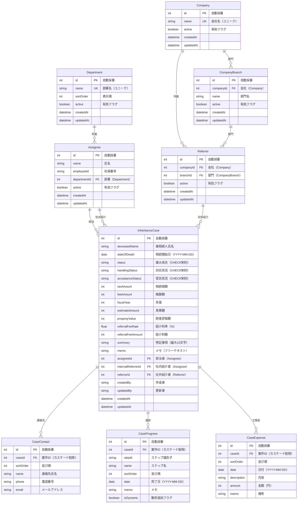

# 相続税案件管理システム

## 概要

相続税申告案件を管理するシステムです。案件の進捗管理、担当者・紹介者のマスタ管理、経営分析ダッシュボード、CSV取込・出力、JSONバックアップ・リストア機能を提供します。

## 技術スタック

| レイヤー | 技術 |
|---------|------|
| Frontend | Next.js 16.1.1, React 19.2.3, TypeScript 5.9.3, Tailwind CSS v4 |
| Data | TanStack Query 5.64, TanStack Table 8.21, react-currency-input-field, @dnd-kit |
| Backend | Next.js API Routes, Prisma 6.2, Zod 3.24 |
| Database | PostgreSQL 16 Alpine |
| Charts | recharts 2.15 |
| Other | @react-pdf/renderer, lucide-react, @radix-ui/react-label |
| Infrastructure | Docker, Docker Compose |

## 機能

### 案件管理（CRUD）

- 相続税案件の作成・閲覧・編集・削除
- 進み具合（status）管理: 未着手 / 手続中 / 申告済 / 請求済 / 入金済
- 対応状況（handlingStatus）管理: 対応中 / 対応終了 / 未分割
- 受託状況管理: 受託可 / 受託不可 / 未判定 / 保留
- 受託状況と進み具合の連動ルール:
  - 未判定・保留 → 進み具合は「未着手」のみ選択可
  - 受託不可 → 対応状況は自動的に「対応終了」に設定
  - 受託可 → 未着手 / 手続中 / 申告済 / 請求済 / 入金済 を選択可
- 担当者・社内紹介者・社外紹介者のリレーション（FK）、担当者・社内紹介者は「部門 / 氏名」形式で表示（部門別optgroupグループ化、sortOrder順）
- 報酬・見積・財産評価額・紹介料（率/額）の管理
- 特記事項（10文字以内の短い概要）・メモ（フリーテキスト）の管理
- 申告期限の自動計算（死亡日 + 10ヶ月）
- 和暦表示: 相続開始日・申告期限・進捗完了日に和暦を自動表示（令和/平成/昭和/大正/明治対応）
- フィルタ状態のURL同期: 絞り込み条件がURLクエリパラメータに保持され、ブラウザバック・URL共有で復元可能

### 進捗管理

- 8段階の進捗ステップをタイムラインUIで管理
- 各ステップに完了日・メモを記録
- 訪問ステップの動的追加・削除・再番号付け（isDynamic）
- ドラッグ&ドロップで工程の並べ替え（@dnd-kit）
- チェックボックスで複数工程を選択し、今日の日付を一括設定
- 一覧画面からモーダルで進捗日付をクイック編集
- 一覧画面の進捗列に最終完了工程名を表示
- 進捗が空の案件に「デフォルトステップを追加」ボタン（モーダル・詳細画面両方）
- 進捗ステップの日付入力に応じたステータス自動変更提案（`STATUS_STEP_MAP` + `STEP_NAMES` 定数）:
  - 「申告済」に日付入力 → 「申告済」への変更を確認
  - 「請求済」に日付入力 → 「請求済」への変更を確認
  - 「入金済」に日付入力 → 「入金済」への変更を確認
- ステータスと進捗の整合性チェック（案件詳細の保存時）:
  - ステータスが先行しているが進捗に日付がない場合 → 警告トースト表示
  - 進捗に日付があるがステータスが追いついていない場合 → ステータス変更を提案

### 連絡先管理

- 案件ごとに最大10件の連絡先（氏名・電話番号・メール）を管理
- 並び順の保持（sortOrder）

### マスタ管理

- **部署**: 部署名、表示順（設定画面でCRUD管理）
- **会社**: 会社名（設定画面でCRUD管理、紹介者の所属先）
- **担当者**: 社員番号（3桁）、部署（Departmentマスタからセレクト）、氏名
- **部門（紹介元）**: 会社（Companyマスタからセレクト）、部門名（CompanyBranchマスタ、会社名でグループ表示）
- **紹介者**（社外専用）: 会社（Companyマスタからセレクト）、部門（CompanyBranchマスタからセレクト、会社名でグループ表示）
- 一括編集・一括保存、ソフトデリート（active フラグ）

### 経営分析ダッシュボード（4タブ）

- **売上・件数**: 売上（確定＋見積）サマリーカード（紹介手数料の社内/社外内訳表示、社外紹介手数料控除後の純売上表示）、年度別業績テーブル、ステータス内訳
- **年計表**: 移動年計（直近12ヶ月累計）の売上・件数を折れ線グラフで表示（recharts）
- **部門・担当者（担当者合計）**: 部門→担当者の階層テーブル（部門=大分類、担当者=中分類）
  - 部門行: クリックで担当者の展開/折りたたみ（デフォルト: 閉じた状態）、部門合計（売上・件数・担当/紹介内訳）を常時表示
  - 担当者行: 担当売上＋社内紹介売上の内訳を常時表示
  - 部門はsortOrder順、担当者はid（登録順）、未設定部門は末尾
  - 「すべて開く/すべて閉じる」一括切替ボタン
  - 担当者名はリンク（クリックで一覧画面に遷移、`staffId`パラメータで担当＋紹介の全案件を表示）
  - 「未設定」もリンク化（`unassigned`パラメータで担当者未設定案件を表示）
  - 年度フィルタの引き継ぎ（1年度選択時のみ）
- **紹介者**: 会社別実績に部門小計表示、「なし」は常に最下部に表示
  - 会社名はリンク（クリックで一覧画面に遷移、`referrerCompany`パラメータでその会社の紹介案件を表示）
  - 「なし」もリンク化（`noReferrer`パラメータで紹介者未設定案件を表示）
  - 年度フィルタの引き継ぎ
- 年度ピルUI: 全期間 + 個別年度をトグルボタンで複数選択可能（デフォルト: 現在年度、データに現在年度がなければ最新年度にフォールバック）

### CSV取込・出力

- 案件データのCSVエクスポート（担当者・社内紹介者・社外紹介者は複数列形式）
- CSVインポートによる一括登録・更新（バリデーション付き）
- 担当者・社内紹介者・社外紹介者の複数列方式取込（`担当者_氏名`/`担当者_部署名`、`社内紹介者_氏名`、`紹介者_会社名`/`紹介者_部署名`）
- 社内紹介者: Assignee名でマッチング、未登録時は自動作成
- 未登録のマスタデータ（部署・会社・担当者・紹介者）をインポート時に自動作成
- 旧形式（`担当者`/`紹介者` 1列）も後方互換で対応
- インポート時に進捗データが空なら自動でデフォルトステップをセット
- 日付の正規化（Excel形式 YYYY/M/D 対応）
- 社外紹介者の2段階フォールバック解決: 会社+部署 → 会社（一意の場合のみ）
- 重複検出（被相続人氏名＋死亡日＋年度）で既存案件を自動的に更新モードに切替（再インポート時の重複登録を防止）
- 存在しないIDの案件は新規作成にフォールバック
- ファイル選択時にマスターデータを最新に再読込

### JSONバックアップ / リストア

- 全9テーブルのデータをJSON形式でエクスポート（`itcm-backup-YYYY-MM-DD.json`）
- JSONファイルからの全データリストア（プレビュー + 確認入力付き）
- リストアはトランザクション内で全削除→全挿入→シーケンスリセットをアトミックに実行

### 案件一括削除

- フィルタ条件（年度・ステータス・受託状況・部門・担当者・紹介者・紹介会社・検索）で絞り込んだ案件を一括削除
- 削除件数の手入力による確認（誤操作防止）
- フィルタ適用時のみ一括削除ボタンを表示

### KPIダッシュボード

- 案件総数 / 進行中 / 期限間近（30日以内）/ 完了の4指標をカード表示
- フィルター連動: フィルタ適用時はフィルタ後の件数を反映

### ソート

- デフォルト: 年度降順（新しい年度が上）→ 死亡日昇順（古い日付が上）
- 年度ソートは常に最優先（ユーザーが選択するソートは第2ソートキー）

### UI/UX

- **ステータスバッジ**: 進み具合（灰=未着手/青=手続中/緑=申告済/橙=請求済/紫=入金済）、対応状況（対応中/対応終了/未分割）、受託状況（緑/赤/灰/琥珀）を色付きバッジで表示
- **期限インジケーター**: 期限切れ（赤）/ 期限間近（琥珀）を視覚的に警告、完了系は「申告済」バッジ、対応終了は取消線表示
- **申告期限2段表示**: ステータスバッジ + 日付を2段で表示
- **売上列ソート**: クライアントサイドでソート可能
- **売上合計バー**: テーブル上部に常時表示（確定/見込内訳付き）
- **進捗タイムライン**: 縦タイムラインUI（完了=緑ドット、未完了=グレードット）
- **インライン編集**: 一覧画面で特記事項をクリックして即時編集・保存
- **売上列**: 報酬額入力済→確定（緑）、未入力→見込額（青）のラベルを金額の上に配置
- **フィルターチップ**: 適用中のフィルターをチップ表示し、個別に解除可能
- **フィルター**: 年度（2015〜2035）・受託状況（複数選択）・ステータス（複数選択）・対応状況・部門・担当者・紹介者（社内）・紹介会社をdata-driven定義（`FILTER_KEYS`/`STATIC_FILTER_DEFS`）
  - 担当者・紹介者（社内）セレクトボックスは部門別 `<optgroup>` でグループ化（sortOrder順）
  - 紹介者（社内）セレクトボックスはオレンジボーダーで担当者と視覚的に区別
  - フィルタチップの色分け: 紹介者=オレンジ系、その他=プライマリ系
  - `staffId` パラメータ: 経営分析からの遷移用、担当＋紹介の全案件を OR 条件で取得
  - `referrerCompany` パラメータ: 経営分析からの遷移用、紹介会社名でフィルタ
  - `unassigned` パラメータ: 担当者未設定案件の絞り込み
  - `noReferrer` パラメータ: 紹介者未設定案件の絞り込み
- **役割列**: 担当者・紹介者・staffIdフィルタ適用時に自動表示、担当=青バッジ、紹介=オレンジバッジ
- **フィルタURL同期**: フィルタ条件をURLクエリパラメータに同期（`?fiscalYear=2023&status=手続中`）、ブラウザバック・共有URL対応
- **表示件数**: デフォルト100件
- **キーボードナビゲーション**: テーブル行の矢印キー移動・Enterで詳細遷移
- **スティッキーアクションバー**: 保存/キャンセル/削除ボタンがスクロール時も表示
- **折りたたみセクション**: フォーム各セクションの展開/折りたたみ
- **ローディングスケルトン**: データ取得中のプレースホルダーUI
- **トースト通知**: 成功/エラー/警告メッセージ
- **空状態メッセージ**: 検索結果なし時の案内表示
- **モーダルダイアログ**: CSV取込、進捗編集、一括削除確認、確認ダイアログ
- **案件詳細の保存後遷移**: 保存完了後にブラウザバックで一覧画面に遷移（フィルタ状態を維持）
- **ポータルに戻るボタン**: aタグで外部遷移（クライアントサイドルーティング外）
- **年度セレクトボックス**: 降順表示（新しい年度が上）
- **MasterSelectリンク**: Link化によるクライアントサイドルーティング
- **MasterSelect表示**: 担当者・社内紹介者を「部門 / 氏名」形式で表示、部門別optgroupグループ化

## ページ構成

| パス | 内容 |
|------|------|
| `/` | 案件一覧（KPI + フィルター + テーブル + ページネーション + 一括削除） |
| `/new` | 新規案件登録 |
| `/[id]` | 案件詳細編集（基本情報/金額/進捗/連絡先の4セクション） |
| `/settings` | 設定メニュー |
| `/settings/departments` | 部署マスタ管理 |
| `/settings/assignees` | 担当者マスタ管理 |
| `/settings/companies` | 会社マスタ管理 |
| `/settings/company-branches` | 部門マスタ管理（紹介元） |
| `/settings/referrers` | 紹介者マスタ管理 |
| `/settings/backup` | バックアップ / リストア |
| `/analytics` | 経営分析ダッシュボード（売上・件数/年計表/部門・担当者/紹介者の4タブ） |

## ディレクトリ構成

```
inheritance-case-management/
├── .env                        # PostgreSQL認証情報
├── docker-compose.yml          # 開発用（PostgreSQL + Web）
├── docker-compose.prod.yml     # 本番オーバーライド
└── web/                        # Next.js（フロントエンド + API Routes）
    ├── Dockerfile              # マルチステージビルド（dev/builder/runner）
    ├── Dockerfile.dev
    ├── docker-entrypoint.sh
    ├── package.json
    ├── next.config.ts          # basePath: /itcm
    ├── prisma/
    │   └── schema.prisma       # DBスキーマ（9モデル: Department, Company, CompanyBranch, Assignee, Referrer, InheritanceCase, CaseContact, CaseProgress, CaseExpense）
    └── src/
        ├── app/
        │   ├── page.tsx                # 案件一覧
        │   ├── columns.tsx             # TanStack Table カラム定義
        │   ├── data-table.tsx          # DataTable コンポーネント
        │   ├── FilterBar.tsx           # フィルターUI
        │   ├── KPICards.tsx            # KPI指標カード
        │   ├── Pagination.tsx          # ページネーション
        │   ├── InlineSummaryCell.tsx    # 特記事項インライン編集セル
        │   ├── ProgressModal.tsx       # 進捗クイック編集モーダル（D&D対応）
        │   ├── new/page.tsx            # 新規案件登録
        │   ├── [id]/                   # 案件詳細
        │   │   ├── page.tsx
        │   │   ├── edit-case-form.tsx  # メインフォーム
        │   │   ├── BasicInfoSection.tsx
        │   │   ├── FinancialSection.tsx
        │   │   ├── ProgressEditor.tsx  # タイムライン進捗UI（D&D対応）
        │   │   └── ContactListEditor.tsx
        │   ├── settings/               # マスタ管理
        │   │   ├── page.tsx
        │   │   ├── departments/page.tsx
        │   │   ├── assignees/page.tsx
        │   │   ├── companies/page.tsx
        │   │   ├── company-branches/page.tsx
        │   │   ├── referrers/page.tsx
        │   │   └── backup/page.tsx
        │   ├── analytics/              # 経営分析
        │   │   ├── page.tsx
        │   │   ├── OverviewTab.tsx
        │   │   ├── BreakdownTab.tsx
        │   │   ├── ReferrerTab.tsx
        │   │   ├── AnnualTrendTab.tsx  # 年計表（移動年計グラフ、recharts）
        │   │   └── RankingTable.tsx
        │   └── api/                    # API Routes
        │       ├── health/route.ts
        │       ├── backup/
        │       │   ├── route.ts        # GET（全データエクスポート）
        │       │   └── restore/route.ts # POST（全データリストア）
        │       ├── cases/
        │       │   ├── route.ts        # GET（一覧+フィルタ）, POST（作成）
        │       │   ├── [id]/route.ts   # GET, PUT, DELETE
        │       │   └── bulk-delete/route.ts # DELETE（フィルタ条件一括削除）
        │       ├── departments/
        │       │   ├── route.ts
        │       │   ├── handlers.ts     # ファクトリベースCRUD
        │       │   └── [id]/route.ts
        │       ├── companies/
        │       │   ├── route.ts
        │       │   ├── handlers.ts     # ファクトリベースCRUD
        │       │   └── [id]/route.ts
        │       ├── company-branches/
        │       │   ├── route.ts
        │       │   ├── handlers.ts     # ファクトリベースCRUD（Company include付き）
        │       │   └── [id]/route.ts
        │       ├── assignees/
        │       │   ├── route.ts
        │       │   ├── handlers.ts     # ファクトリベースCRUD（include対応）
        │       │   └── [id]/route.ts
        │       └── referrers/
        │           ├── route.ts
        │           ├── handlers.ts     # ファクトリベースCRUD（include対応）
        │           └── [id]/route.ts
        ├── components/
        │   ├── AppHeader.tsx           # ヘッダーナビゲーション
        │   ├── BulkDeleteModal.tsx     # 一括削除確認ダイアログ
        │   ├── ClientLayout.tsx        # QueryClient + Toast プロバイダー
        │   ├── ImportCSVModal.tsx       # CSV取込ダイアログ（ステップ別コンポーネントを統合）
        │   ├── import-csv/             # CSV取込ステップ別コンポーネント
        │   │   ├── FileSelectStep.tsx  # ファイル選択（D&D・テンプレDL・項目ガイド）
        │   │   ├── PreviewStep.tsx     # プレビュー（サマリーバッジ・テーブル・警告/エラー）
        │   │   ├── ImportingStep.tsx   # 取り込み中（プログレスバー・中止）
        │   │   └── DoneStep.tsx        # 完了（結果サマリー・失敗行詳細）
        │   ├── MasterListPage.tsx      # マスタ編集UI（共通）
        │   └── ui/                     # 汎用UIコンポーネント
        │       ├── Button.tsx
        │       ├── CollapsibleSection.tsx
        │       ├── CurrencyField.tsx
        │       ├── EmptyState.tsx
        │       ├── ErrorDisplay.tsx
        │       ├── Input.tsx / Label.tsx
        │       ├── MasterSelect.tsx        # マスタセレクター（optgroup対応）
        │       ├── Modal.tsx
        │       ├── MultiSelectDropdown.tsx # チェックボックス式複数選択ドロップダウン
        │       ├── SelectField.tsx
        │       ├── Skeleton.tsx
        │       ├── SortableHeader.tsx
        │       ├── StatusBadge.tsx
        │       ├── SetTodayButton.tsx
        │       ├── StickyActionBar.tsx
        │       ├── Toast.tsx
        │       └── table.tsx           # TanStack Table ラッパー
        ├── hooks/
        │   ├── index.ts                # barrel export
        │   ├── use-async-masters.ts    # 担当者・部署マスタ非同期取得（共通フック）
        │   ├── use-cases.ts            # 案件一覧クエリ（TanStack Query）
        │   ├── use-click-outside.ts    # 要素外クリック検知フック
        │   ├── use-error-handler.ts
        │   ├── use-export-csv.ts       # CSVエクスポート
        │   ├── use-import-csv.ts       # CSVインポート（マスタ自動作成対応）
        │   ├── use-keyboard-navigation.ts
        │   ├── use-master-list.ts      # マスタ編集ステート管理
        │   ├── use-progress-steps.ts   # 進捗チェック・D&D・一括日付設定
        │   └── use-ranking-sort.ts     # 経営分析ランキングソート
        ├── lib/
        │   ├── prisma.ts               # Prisma クライアントシングルトン
        │   ├── prisma-includes.ts      # Prisma include定義（CASE/ASSIGNEE/REFERRER）
        │   ├── prisma-utils.ts
        │   ├── api-error-handler.ts    # 統一エラーレスポンス
        │   ├── case-converters.ts      # 案件データ変換ユーティリティ
        │   ├── create-crud-route-handlers.ts  # CRUD APIルートファクトリ（include対応）
        │   ├── error-utils.ts          # エラーユーティリティ
        │   ├── analytics/              # 集計・分析ロジック（モジュール分割）
        │   │   ├── calculations.ts     # calcNet, calcReferralFee, formatCurrency, formatDate, toWareki, formatDateWithWareki, pinBottomCompare
        │   │   ├── aggregations.ts     # aggregateCases, computeRollingAnnual, 型定義
        │   │   └── index.ts            # re-export
        │   ├── analytics-utils.ts      # 後方互換re-export（→ analytics/）
        │   ├── import/                 # CSVインポートロジック（モジュール分割）
        │   │   ├── types.ts            # 型定義・定数（CSV_HEADER_MAP, DEFAULTABLE_FIELDS等）
        │   │   ├── parser.ts           # CSVテキストパーサー・日付正規化・数値パース
        │   │   ├── converters.ts       # ヘッダー→カラムマップ構築・行→入力オブジェクト変換
        │   │   ├── validator.ts        # パース&バリデーション・重複検出・リゾルバー構築
        │   │   └── index.ts            # re-export
        │   ├── import-csv.ts           # 後方互換re-export（→ import/）
        │   ├── kpi-utils.ts            # KPI計算
        │   ├── deadline-utils.ts       # 申告期限計算（死亡日+10ヶ月）
        │   ├── progress-utils.ts       # 訪問ステップ追加/削除
        │   ├── export-csv.ts
        │   ├── utils.ts
        │   └── api/                    # クライアントサイドAPI
        │       ├── client.ts           # fetchラッパー（baseURL: /itcm/api）
        │       ├── cases.ts            # 案件CRUD + 一括削除
        │       ├── masters.ts          # 5マスタAPI統合（companies/company-branches/departments/assignees/referrers）
        │       ├── company-branches.ts # re-export（→ masters.ts）
        │       ├── companies.ts        # re-export（→ masters.ts）
        │       ├── departments.ts      # re-export（→ masters.ts）
        │       ├── assignees.ts        # re-export（→ masters.ts）
        │       ├── referrers.ts        # re-export（→ masters.ts）
        │       ├── backup.ts           # バックアップ/リストア
        │       ├── crud-factory.ts     # 汎用CRUDクライアントファクトリ
        │       └── index.ts
        └── types/
            ├── shared.ts               # TypeScript型定義（Department, Company, Assignee, Referrer等）
            ├── validation.ts           # Zodバリデーションスキーマ
            ├── backup.ts               # バックアップJSON型定義
            └── constants.ts            # UI定数（ステータス色、ソート、年度等）
```

## API エンドポイント

### 案件 `/api/cases`

| メソッド | パス | 説明 |
|---------|------|------|
| GET | `/api/cases` | 案件一覧取得（ページネーション・フィルタ・ソート） |
| POST | `/api/cases` | 案件作成（連絡先・進捗含む） |
| GET | `/api/cases/:id` | 案件詳細取得（リレーション含む） |
| PUT | `/api/cases/:id` | 案件更新（連絡先・進捗の洗い替え、楽観ロック対応） |
| DELETE | `/api/cases/:id` | 案件削除（連絡先・進捗もカスケード削除） |
| DELETE | `/api/cases/bulk-delete` | フィルタ条件に一致する案件を一括削除 |

**GET /api/cases クエリパラメータ:**

| パラメータ | 型 | 説明 |
|-----------|-----|------|
| page | int | ページ番号（デフォルト: 1） |
| pageSize | int | 1ページあたりの件数（デフォルト: 100） |
| status | string | 進み具合フィルタ（カンマ区切りで複数指定可） |
| handlingStatus | string | 対応状況フィルタ（カンマ区切りで複数指定可） |
| acceptanceStatus | string | 受託状況フィルタ |
| fiscalYear | int | 年度フィルタ |
| department | string | 部門フィルタ（担当者の部署でリレーション経由フィルタ） |
| assigneeId | int | 担当者フィルタ |
| internalReferrerId | int | 社内紹介者フィルタ |
| staffId | int | 担当者OR社内紹介者フィルタ（担当＋紹介の全案件をOR条件で取得） |
| referrerCompany | string | 紹介会社名フィルタ（社外紹介者の会社でリレーション経由フィルタ） |
| unassigned | boolean | 担当者未設定フィルタ（`true`で`assigneeId=null`の案件のみ） |
| noReferrer | boolean | 紹介者未設定フィルタ（`true`で社内・社外とも紹介者なしの案件のみ） |
| search | string | 被相続人氏名の部分一致検索 |
| sortBy | string | ソートキー（デフォルト: dateOfDeath） |
| sortOrder | string | ソート順（デフォルト: asc）※年度降順は常に最優先 |

**PUT /api/cases/:id 楽観ロック（Optimistic Locking）:**

リクエストボディに `updatedAt`（ISO 8601）を含めると、DBの `updatedAt` と比較し、不一致の場合は **409 Conflict** を返す。

### マスタ管理

| メソッド | パス | 説明 |
|---------|------|------|
| GET/POST | `/api/departments` | 部署一覧 / 作成 |
| GET/PUT/DELETE | `/api/departments/:id` | 部署取得 / 更新 / 削除 |
| GET/POST | `/api/companies` | 会社一覧 / 作成 |
| GET/PUT/DELETE | `/api/companies/:id` | 会社取得 / 更新 / 削除 |
| GET/POST | `/api/assignees` | 担当者一覧 / 作成（Department include付き） |
| GET/PUT/DELETE | `/api/assignees/:id` | 担当者取得 / 更新 / 削除 |
| GET/POST | `/api/company-branches` | 部門一覧 / 作成（Company include付き） |
| GET/PUT/DELETE | `/api/company-branches/:id` | 部門取得 / 更新 / 削除 |
| GET/POST | `/api/referrers` | 紹介者一覧 / 作成（Company, Branch include付き） |
| GET/PUT/DELETE | `/api/referrers/:id` | 紹介者取得 / 更新 / 削除 |

### バックアップ

| メソッド | パス | 説明 |
|---------|------|------|
| GET | `/api/backup` | 全データJSONエクスポート |
| POST | `/api/backup/restore` | JSONからの全データリストア |

### その他

| メソッド | パス | 説明 |
|---------|------|------|
| GET | `/api/health` | ヘルスチェック |

## データベーススキーマ


```mermaid
erDiagram
    Department ||--o{ Assignee : "所属"
    Company ||--o{ CompanyBranch : "部門"
    Company ||--o{ Referrer : "所属"
    CompanyBranch ||--o{ Referrer : "部門"
    Assignee ||--o{ InheritanceCase : "担当"
    Assignee ||--o{ InheritanceCase : "社内紹介"
    Referrer ||--o{ InheritanceCase : "社外紹介"
    InheritanceCase ||--o{ CaseContact : "連絡先"
    InheritanceCase ||--o{ CaseProgress : "進捗"
    InheritanceCase ||--o{ CaseExpense : "立替金"

    Department {
        int id PK "自動採番"
        string name UK "部署名（ユニーク）"
        int sortOrder "表示順"
        boolean active "有効フラグ"
        datetime createdAt
        datetime updatedAt
    }

    Company {
        int id PK "自動採番"
        string name UK "会社名（ユニーク）"
        boolean active "有効フラグ"
        datetime createdAt
        datetime updatedAt
    }

    CompanyBranch {
        int id PK "自動採番"
        int companyId FK "会社（Company）"
        string name "部門名"
        boolean active "有効フラグ"
        datetime createdAt
        datetime updatedAt
    }

    Assignee {
        int id PK "自動採番"
        string name "氏名"
        string employeeId "社員番号"
        int departmentId FK "部署（Department）"
        boolean active "有効フラグ"
        datetime createdAt
        datetime updatedAt
    }

    Referrer {
        int id PK "自動採番"
        int companyId FK "会社（Company）"
        int branchId FK "部門（CompanyBranch）"
        boolean active "有効フラグ"
        datetime createdAt
        datetime updatedAt
    }

    InheritanceCase {
        int id PK "自動採番"
        string deceasedName "被相続人氏名"
        date dateOfDeath "相続開始日（YYYY-MM-DD）"
        string status "進み具合（CHECK制約）"
        string handlingStatus "対応状況（CHECK制約）"
        string acceptanceStatus "受託状況（CHECK制約）"
        int taxAmount "相続税額"
        int feeAmount "報酬額"
        int fiscalYear "年度"
        int estimateAmount "見積額"
        int propertyValue "財産評価額"
        float referralFeeRate "紹介料率（%）"
        int referralFeeAmount "紹介料額"
        string summary "特記事項（最大10文字）"
        string memo "メモ（フリーテキスト）"
        int assigneeId FK "担当者（Assignee）"
        int internalReferrerId FK "社内紹介者（Assignee）"
        int referrerId FK "社外紹介者（Referrer）"
        string createdBy "作成者"
        string updatedBy "更新者"
        datetime createdAt
        datetime updatedAt
    }

    CaseContact {
        int id PK "自動採番"
        int caseId FK "案件ID（カスケード削除）"
        int sortOrder "並び順"
        string name "連絡先氏名"
        string phone "電話番号"
        string email "メールアドレス"
    }

    CaseProgress {
        int id PK "自動採番"
        int caseId FK "案件ID（カスケード削除）"
        string stepId "ステップ識別子"
        string name "ステップ名"
        int sortOrder "並び順"
        date date "完了日（YYYY-MM-DD）"
        string memo "メモ"
        boolean isDynamic "動的追加フラグ"
    }

    CaseExpense {
        int id PK "自動採番"
        int caseId FK "案件ID（カスケード削除）"
        int sortOrder "並び順"
        date date "日付（YYYY-MM-DD）"
        string description "内容"
        int amount "金額（円）"
        string memo "備考"
    }
```

## 設計パターン

- **CRUDルートファクトリ**: `createCrudRouteHandlers()` で部署・会社・担当者・紹介者のAPIルートを共通生成（`include`オプション対応）
- **CRUDクライアントファクトリ**: `crud-factory.ts` でフロントエンドAPIクライアントを共通生成、`masters.ts` で4マスタ（会社/部署/担当者/紹介者）を統合
- **マスタ編集共通化**: `MasterListPage` + `useMasterList` で4つのマスタ管理画面の編集UIを共通化（groupByによるグループ表示対応）
- **where句ビルダー共通化**: `buildCaseWhereClause()` で案件一覧取得と一括削除のフィルタ条件構築を共通化
- **マスタ自動作成**: CSVインポート時に未登録のDepartment/Company/CompanyBranch/Assignee/Referrerを `resolveOrCreateByName` ジェネリック関数で自動作成
- **リストアのデータ駆動化**: `TABLE_DEFS` 配列でテーブル定義・行変換・シーケンス名を一元管理し、ループで全テーブルを処理
- **ステータス⇔進捗連動**: `STATUS_STEP_MAP` + `STATUS_ORDER` + `STEP_NAMES` で一元管理、進捗モーダル保存時・案件詳細保存時の双方向整合性チェック
- **TanStack Query**: サーバーステート管理（キャッシュ・再取得・楽観的更新）
- **Zodバリデーション**: リクエストボディの型安全な検証
- **フィルタ定数一元管理**: `FILTER_KEYS` でフィルタキーを一元管理し、hasFilters判定・KPI依存・フィルタUI定義を自動化
- **ステータスカテゴリ定数**: `COMPLETED_STATUSES`（申告完了系）/ `DEADLINE_SKIP_STATUSES`（期限チェック対象外）/ `HANDLING_STATUS_VALUES`（対応状況）で判定ロジックを一元管理
- **コンポーネント分割**: フォームを4セクション（BasicInfo/Financial/Progress/Contact）に分割、CSV取込モーダルを4ステップコンポーネント（FileSelect/Preview/Importing/Done）に分割
- **セルファクトリ**: `statusCell()` でステータスバッジ列の定義を共通化、`formatDate()` で日付フォーマットを統一
- **マスタ取得共通化**: `useAsyncMasters` フックで担当者・部署の非同期取得パターンを一元化
- **モジュール分割**: `import-csv.ts`（629行）→ `lib/import/`（types/parser/converters/validator）、`analytics-utils.ts`（217行）→ `lib/analytics/`（calculations/aggregations）に分割し、旧ファイルは後方互換re-exportとして維持
- **DB正規化**: Department・Company・CompanyBranch テーブル分離（3NF）、Assignee.departmentId / Referrer.companyId + branchId でFK参照。紹介元の部門はCompanyBranchマスタで管理（表記ゆれ防止）。社内紹介者はAssigneeテーブルで一元管理（InheritanceCase.internalReferrerId → Assignee）
- **CHECK制約**: status / acceptanceStatus の有効値をDB レベルで強制
- **Date変換ヘルパー**: `toDate` / `toDateStr` / `serializeCase` でAPI境界のDate↔文字列変換を一元化
- **楽観ロック**: `updatedAt` ベースの Optimistic Locking で同時編集を検知
- **和暦変換**: `toWareki()` / `formatDateWithWareki()` で令和/平成/昭和/大正/明治を自動判定し、日付表示に和暦を併記
- **フィルタURL同期**: `useSearchParams` + `router.replace` でフィルタ状態をURLクエリパラメータに双方向同期、`popstate` リスナーでブラウザバック復元
- **紹介者2段階解決**: `buildResolverMaps` で会社+部署 / 会社（一意時のみ）の2段階キーを構築、CSV取込時の社外紹介者マッチングの正確性を向上
- **社内/社外紹介者分離**: 社内紹介者は `Assignee` テーブルで管理（`internalReferrerId`）、社外紹介者は `Referrer` テーブルで管理（`referrerId`）。同一人物の重複管理を排除
- **紹介料の社内/社外分離**: `calcReferralFee` で紹介料算出、`calcNet` は社外紹介料のみ控除（会社純売上）、担当者個人集計では全紹介料を控除
- **年度ピルUI**: `selectedYears: Set<number>` で複数年度をトグル選択、`isAllYears` フラグで全期間表示を制御
- **部門→担当者階層構築**: `assigneesData` と `assigneeRanking` をマージし、部門sortOrder順・担当者id順で階層グループを構築
- **ランキングソートフック**: `useRankingSort` で汎用的なソート状態管理（key/direction切替）を提供

## クイックスタート

### 前提条件

- Docker & Docker Compose

### 開発環境の起動

```bash
# 1. 環境変数を設定
cp .env.example .env

# 2. 開発環境を起動
docker compose up --build

# 3. ブラウザでアクセス
# Web + API: http://localhost:3020
```

### 本番環境の起動

```bash
docker compose -f docker-compose.yml -f docker-compose.prod.yml up --build -d
```

> **Note**: `manage.bat start` で全アプリを起動する場合は、Nginx Gateway 経由で http://localhost/itcm/ からアクセスできます。

## ポート設定

| サービス | ポート | URL |
|---------|--------|-----|
| Web + API | 3020 | http://localhost:3020 |
| PostgreSQL | 3022 | localhost:3022 |

## 開発コマンド

```bash
# コンテナに入ってコマンド実行
docker exec -it itcm-frontend sh

# Prisma Studio（DB GUI）
docker exec -it itcm-frontend npx prisma studio

# マイグレーション実行
docker exec -it itcm-frontend npx prisma migrate deploy

# ログ確認
docker compose logs -f web

# コンテナ停止
docker compose down

# データも含めて削除
docker compose down -v
```
