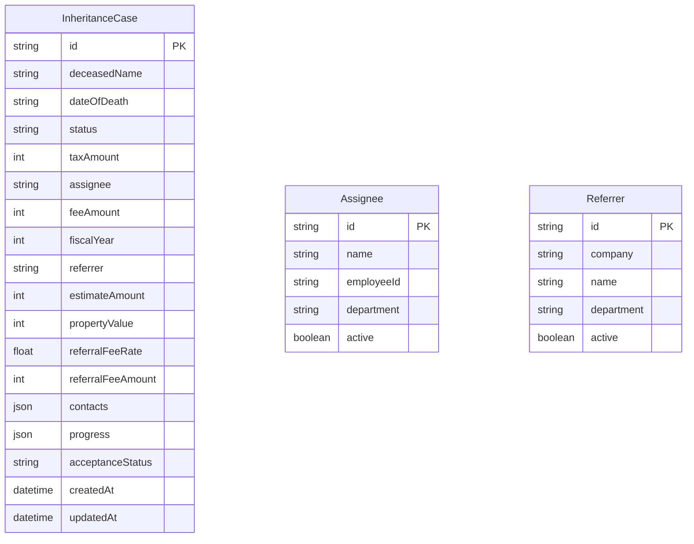

# Database Schema

## ER Diagram

## Models Description

### InheritanceCase
メインの案件管理テーブル。
- `assignee`: 担当者名またはID（現状は非正規化または緩い参照）
- `referrer`: 紹介者名またはID（現状は非正規化または緩い参照）
- `contacts`: 連絡先情報の配列（JSON）
- `progress`: 進捗ステップの配列（JSON）

### Assignee
社内の担当者マスター。
- `active`: 論理削除用フラグ

### Referrer
紹介者（税理士、業者など）マスター。
- `active`: 論理削除用フラグ
