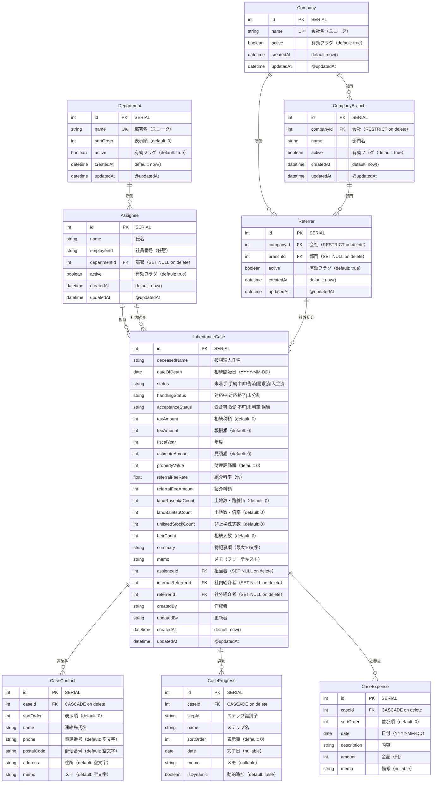

# Database Schema

## ER Diagram

```mermaid
erDiagram
    Department ||--o{ Assignee : "所属"
    Company ||--o{ CompanyBranch : "部門"
    Company ||--o{ Referrer : "所属"
    CompanyBranch ||--o{ Referrer : "部門"
    Assignee ||--o{ InheritanceCase : "担当"
    Assignee ||--o{ InheritanceCase : "社内紹介"
    Referrer ||--o{ InheritanceCase : "社外紹介"
    InheritanceCase ||--o{ CaseContact : "連絡先"
    InheritanceCase ||--o{ CaseProgress : "進捗"
    InheritanceCase ||--o{ CaseExpense : "立替金"

    Department {
        int id PK "SERIAL"
        string name UK "部署名（ユニーク）"
        int sortOrder "表示順（default: 0）"
        boolean active "有効フラグ（default: true）"
        datetime createdAt "default: now()"
        datetime updatedAt "@updatedAt"
    }

    Company {
        int id PK "SERIAL"
        string name UK "会社名（ユニーク）"
        boolean active "有効フラグ（default: true）"
        datetime createdAt "default: now()"
        datetime updatedAt "@updatedAt"
    }

    CompanyBranch {
        int id PK "SERIAL"
        int companyId FK "会社（RESTRICT on delete）"
        string name "部門名"
        boolean active "有効フラグ（default: true）"
        datetime createdAt "default: now()"
        datetime updatedAt "@updatedAt"
    }

    Assignee {
        int id PK "SERIAL"
        string name "氏名"
        string employeeId "社員番号（任意）"
        int departmentId FK "部署（SET NULL on delete）"
        boolean active "有効フラグ（default: true）"
        datetime createdAt "default: now()"
        datetime updatedAt "@updatedAt"
    }

    Referrer {
        int id PK "SERIAL"
        int companyId FK "会社（RESTRICT on delete）"
        int branchId FK "部門（SET NULL on delete）"
        boolean active "有効フラグ（default: true）"
        datetime createdAt "default: now()"
        datetime updatedAt "@updatedAt"
    }

    InheritanceCase {
        int id PK "SERIAL"
        string deceasedName "被相続人氏名"
        date dateOfDeath "相続開始日（YYYY-MM-DD）"
        string status "未着手|手続中|申告済|請求済|入金済"
        string handlingStatus "対応中|対応終了|未分割"
        string acceptanceStatus "受託可|受託不可|未判定|保留"
        int taxAmount "相続税額（default: 0）"
        int feeAmount "報酬額（default: 0）"
        int fiscalYear "年度"
        int estimateAmount "見積額（default: 0）"
        int propertyValue "財産評価額（default: 0）"
        float referralFeeRate "紹介料率（%）"
        int referralFeeAmount "紹介料額"
        int landRosenkaCount "土地数・路線価（default: 0）"
        int landBairitsuCount "土地数・倍率（default: 0）"
        int unlistedStockCount "非上場株式数（default: 0）"
        int heirCount "相続人数（default: 0）"
        string summary "特記事項（最大10文字）"
        string memo "メモ（フリーテキスト）"
        int assigneeId FK "担当者（SET NULL on delete）"
        int internalReferrerId FK "社内紹介者（SET NULL on delete）"
        int referrerId FK "社外紹介者（SET NULL on delete）"
        string createdBy "作成者"
        string updatedBy "更新者"
        datetime createdAt "default: now()"
        datetime updatedAt "@updatedAt"
    }

    CaseContact {
        int id PK "SERIAL"
        int caseId FK "CASCADE on delete"
        int sortOrder "表示順（default: 0）"
        string name "連絡先氏名"
        string phone "電話番号（default: 空文字）"
        string postalCode "郵便番号（default: 空文字）"
        string address "住所（default: 空文字）"
        string memo "メモ（default: 空文字）"
    }

    CaseProgress {
        int id PK "SERIAL"
        int caseId FK "CASCADE on delete"
        string stepId "ステップ識別子"
        string name "ステップ名"
        int sortOrder "表示順（default: 0）"
        date date "完了日（nullable）"
        string memo "メモ（nullable）"
        boolean isDynamic "動的追加（default: false）"
    }

    CaseExpense {
        int id PK "SERIAL"
        int caseId FK "CASCADE on delete"
        int sortOrder "並び順（default: 0）"
        date date "日付（YYYY-MM-DD）"
        string description "内容"
        int amount "金額（円）"
        string memo "備考（nullable）"
    }
```

## Models Description

### Department

社内の部署マスター。担当者の所属部署として使用。

| カラム | 型 | 必須 | デフォルト | 説明 |
|--------|-----|------|-----------|------|
| id | Int | PK | autoincrement | 自動採番 |
| name | String | Yes (UK) | - | 部署名（ユニーク制約） |
| sortOrder | Int | Yes | 0 | 表示順 |
| active | Boolean | Yes | true | 有効フラグ（論理削除用） |
| createdAt | DateTime | Yes | now() | 作成日時 |
| updatedAt | DateTime | Yes | @updatedAt | 更新日時 |

**インデックス**: `active`

### Company

紹介者の所属会社マスター。

| カラム | 型 | 必須 | デフォルト | 説明 |
|--------|-----|------|-----------|------|
| id | Int | PK | autoincrement | 自動採番 |
| name | String | Yes (UK) | - | 会社名（ユニーク制約） |
| active | Boolean | Yes | true | 有効フラグ（論理削除用） |
| createdAt | DateTime | Yes | now() | 作成日時 |
| updatedAt | DateTime | Yes | @updatedAt | 更新日時 |

**インデックス**: `active`

### CompanyBranch

紹介元会社の部門・支店マスター。紹介者の所属部門として使用。

| カラム | 型 | 必須 | デフォルト | 説明 |
|--------|-----|------|-----------|------|
| id | Int | PK | autoincrement | 自動採番 |
| companyId | Int | Yes (FK) | - | 会社（RESTRICT on delete） |
| name | String | Yes | - | 部門名 |
| active | Boolean | Yes | true | 有効フラグ（論理削除用） |
| createdAt | DateTime | Yes | now() | 作成日時 |
| updatedAt | DateTime | Yes | @updatedAt | 更新日時 |

**ユニーク制約**: `[companyId, name]`（同一会社内の重複防止）
**インデックス**: `active`, `companyId`

### Assignee

社内の担当者マスター。

| カラム | 型 | 必須 | デフォルト | 説明 |
|--------|-----|------|-----------|------|
| id | Int | PK | autoincrement | 自動採番 |
| name | String | Yes | - | 氏名 |
| employeeId | String | No | null | 社員番号（3桁） |
| departmentId | Int | No (FK) | null | 部署（SET NULL on delete） |
| active | Boolean | Yes | true | 有効フラグ（論理削除用） |
| createdAt | DateTime | Yes | now() | 作成日時 |
| updatedAt | DateTime | Yes | @updatedAt | 更新日時 |

**インデックス**: `active`, `name`, `departmentId`

### Referrer

紹介者（社外専用）マスター。会社＋部門でグループ化。

| カラム | 型 | 必須 | デフォルト | 説明 |
|--------|-----|------|-----------|------|
| id | Int | PK | autoincrement | 自動採番 |
| companyId | Int | Yes (FK) | - | 会社（RESTRICT on delete） |
| branchId | Int | No (FK) | null | 部門（SET NULL on delete） |
| active | Boolean | Yes | true | 有効フラグ（論理削除用） |
| createdAt | DateTime | Yes | now() | 作成日時 |
| updatedAt | DateTime | Yes | @updatedAt | 更新日時 |

**ユニーク制約**: `[companyId, COALESCE(branchId, 0)]`（機能インデックス）
**インデックス**: `active`, `companyId`, `branchId`

### InheritanceCase

メインの案件管理テーブル。

| カラム | 型 | 必須 | デフォルト | 説明 |
|--------|-----|------|-----------|------|
| id | Int | PK | autoincrement | 自動採番（表示時は4桁ゼロ埋め） |
| deceasedName | String | Yes | - | 被相続人氏名 |
| dateOfDeath | Date | Yes | - | 相続開始日（YYYY-MM-DD） |
| status | String | Yes | "未着手" | 進み具合: 未着手 / 手続中 / 申告済 / 請求済 / 入金済 |
| handlingStatus | String | Yes | "対応中" | 対応状況: 対応中 / 対応終了 / 未分割 |
| acceptanceStatus | String | No | "未判定" | 受託可 / 受託不可 / 未判定 / 保留 |
| taxAmount | Int | No | 0 | 相続税額（円） |
| feeAmount | Int | No | 0 | 報酬額（円） |
| fiscalYear | Int | Yes | - | 年度（2015〜2035） |
| estimateAmount | Int | No | 0 | 見積額（円） |
| propertyValue | Int | No | 0 | 財産評価額（円） |
| referralFeeRate | Float | No | null | 紹介料率（%） |
| referralFeeAmount | Int | No | null | 紹介料額（円） |
| landRosenkaCount | Int | No | 0 | 土地数（路線価地域） |
| landBairitsuCount | Int | No | 0 | 土地数（倍率地域） |
| unlistedStockCount | Int | No | 0 | 非上場株式の数 |
| heirCount | Int | No | 0 | 相続人の数 |
| summary | VarChar(10) | No | null | 特記事項（最大10文字） |
| memo | Text | No | null | メモ（フリーテキスト） |
| assigneeId | Int | No (FK) | null | 担当者（SET NULL on delete） |
| internalReferrerId | Int | No (FK) | null | 社内紹介者（SET NULL on delete） |
| referrerId | Int | No (FK) | null | 社外紹介者（SET NULL on delete） |
| createdBy | String | No | null | 作成者 |
| updatedBy | String | No | null | 更新者 |
| createdAt | DateTime | Yes | now() | 作成日時 |
| updatedAt | DateTime | Yes | @updatedAt | 更新日時 |

**インデックス**: `status`, `handlingStatus`, `fiscalYear`, `acceptanceStatus`, `createdAt`, `assigneeId`, `internalReferrerId`, `referrerId`

**ビジネスルール**:
- 申告期限 = dateOfDeath + 10ヶ月（アプリ側で計算）
- 純売上 = feeAmount - referralFeeAmount（分析画面で計算）
- IDは表示上4桁ゼロ埋め（例: 1 → "0001"）
- CSVインポート時の重複判定キー: `deceasedName` + `dateOfDeath` + `fiscalYear`（一致時は更新モード）
- バックアップリストア時はID指定でINSERT後、シーケンスをトランザクション内でリセット

### CaseContact

案件に紐づく連絡先（1対多）。案件削除時にカスケード削除。

| カラム | 型 | 必須 | デフォルト | 説明 |
|--------|-----|------|-----------|------|
| id | Int | PK | autoincrement | 自動採番 |
| caseId | Int | FK | - | InheritanceCase.id（CASCADE on delete） |
| sortOrder | Int | Yes | 0 | 表示順 |
| name | String | Yes | - | 連絡先氏名 |
| phone | String | Yes | "" | 電話番号 |
| postalCode | String | Yes | "" | 郵便番号 |
| address | String | Yes | "" | 住所 |
| memo | String | Yes | "" | メモ |

**インデックス**: `caseId`

### CaseProgress

案件に紐づく進捗ステップ（1対多）。案件削除時にカスケード削除。

| カラム | 型 | 必須 | デフォルト | 説明 |
|--------|-----|------|-----------|------|
| id | Int | PK | autoincrement | 自動採番 |
| caseId | Int | FK | - | InheritanceCase.id（CASCADE on delete） |
| stepId | String | Yes | - | ステップ識別子（例: "step-1"） |
| name | String | Yes | - | ステップ名（例: "1回目訪問"） |
| sortOrder | Int | Yes | 0 | 表示順 |
| date | Date | No | null | 完了日（YYYY-MM-DD） |
| memo | String | No | null | メモ |
| isDynamic | Boolean | Yes | false | 動的に追加されたステップかどうか |

**インデックス**: `caseId`, `[caseId, sortOrder]`（複合）

**ビジネスルール**:
- 新規案件作成時に8つのデフォルトステップを自動生成
- 訪問ステップ（isDynamic=true）は動的に追加・削除可能
- 訪問ステップ削除時は残りの訪問を自動再番号付け

### CaseExpense

案件に紐づく立替金（1対多）。案件削除時にカスケード削除。

| カラム | 型 | 必須 | デフォルト | 説明 |
|--------|-----|------|-----------|------|
| id | Int | PK | autoincrement | 自動採番 |
| caseId | Int | FK | - | InheritanceCase.id（CASCADE on delete） |
| sortOrder | Int | Yes | 0 | 並び順 |
| date | Date | Yes | - | 日付（YYYY-MM-DD） |
| description | String | Yes | - | 内容 |
| amount | Int | Yes | - | 金額（円） |
| memo | String | No | null | 備考 |

**インデックス**: `caseId`, `[caseId, sortOrder]`（複合）

## リレーション概要

| 親テーブル | 子テーブル | 関係 | 削除時の動作 |
|-----------|-----------|------|-------------|
| Department | Assignee | 1対多 | SET NULL（FKをnullに） |
| Company | CompanyBranch | 1対多 | RESTRICT（削除不可） |
| Company | Referrer | 1対多 | RESTRICT（削除不可） |
| CompanyBranch | Referrer | 1対多 | SET NULL（FKをnullに） |
| Assignee | InheritanceCase | 1対多（担当） | SET NULL（FKをnullに） |
| Assignee | InheritanceCase | 1対多（社内紹介） | SET NULL（FKをnullに） |
| Referrer | InheritanceCase | 1対多 | SET NULL（FKをnullに） |
| InheritanceCase | CaseContact | 1対多 | CASCADE（子も削除） |
| InheritanceCase | CaseProgress | 1対多 | CASCADE（子も削除） |
| InheritanceCase | CaseExpense | 1対多 | CASCADE（子も削除） |
