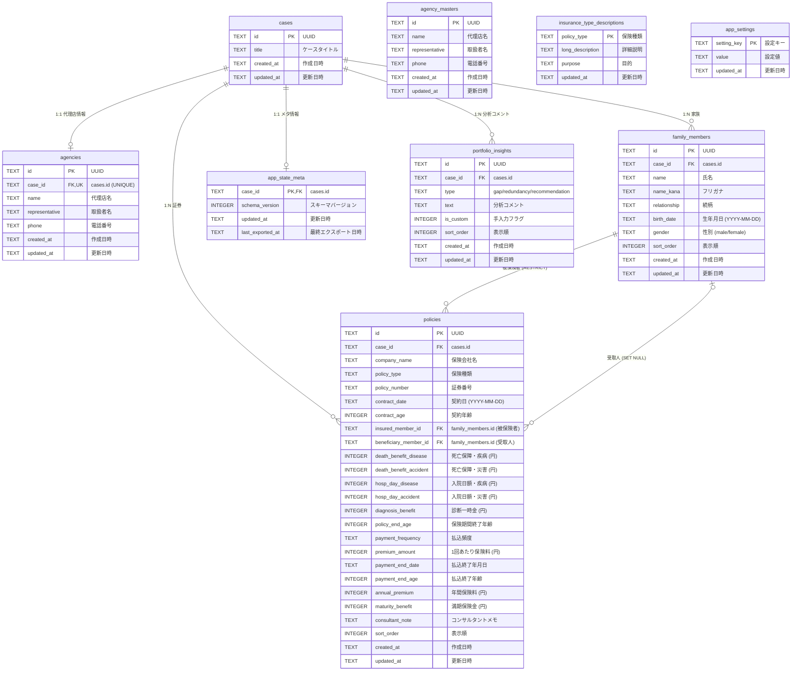

# ER図 — 保険証券分析・診断ダッシュボード

## リレーション一覧

| 親テーブル | 子テーブル | 関係 | FKカラム | 削除時 |
|---|---|---|---|---|
| cases | agencies | 1:1 | case_id (UNIQUE) | CASCADE |
| cases | family_members | 1:N | case_id | CASCADE |
| cases | policies | 1:N | case_id | CASCADE |
| cases | app_state_meta | 1:1 | case_id | CASCADE |
| cases | portfolio_insights | 1:N | case_id | CASCADE |
| family_members | policies | 1:N | insured_member_id | RESTRICT |
| family_members | policies | 0:N | beneficiary_member_id | SET NULL |
| 独立 | agency_masters | - | - | - |
| 独立 | insurance_type_descriptions | - | - | - |
| 独立 | app_settings | - | - | - |

## インデックス

| インデックス名 | テーブル | カラム |
|---|---|---|
| idx_family_members_case_id_sort_order | family_members | `(case_id, sort_order)` |
| idx_policies_case_id_sort_order | policies | `(case_id, sort_order)` |
| idx_policies_case_id_policy_number | policies | `(case_id, policy_number)` |
| idx_policies_insured_member_id | policies | `(insured_member_id)` |
| idx_policies_beneficiary_member_id | policies | `(beneficiary_member_id)` |
| idx_portfolio_insights_case_id | portfolio_insights | `(case_id, sort_order)` |

## 制約

- `family_members.gender`: `male` または `female`
- `policies.payment_frequency`: `monthly`、`annual`、`single`
- `portfolio_insights.type`: `gap`、`redundancy`、`recommendation`
- `agencies.case_id`: `UNIQUE`
- 被保険者 `insured_member_id` は削除時 `RESTRICT`
- 受取人 `beneficiary_member_id` は削除時 `SET NULL`
- `app_settings.setting_key`: 主キー。証券取込プロンプトは `policy_import_prompt`
