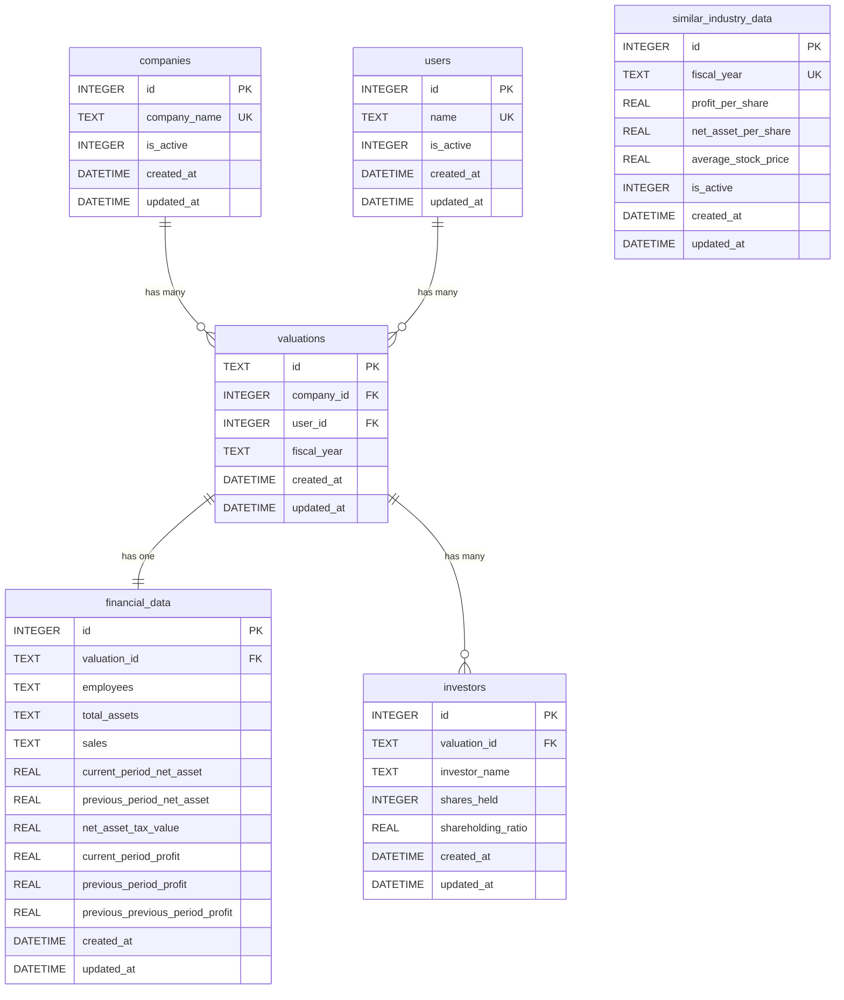

# データベース ER図

## エンティティ関連図（ER Diagram）

```
┌─────────────────────────────────┐       ┌─────────────────────────────────┐
│         companies               │       │           users                 │
│  (会社マスタ)                    │       │  (担当者マスタ)                  │
├─────────────────────────────────┤       ├─────────────────────────────────┤
│ PK  id (INTEGER)                │       │ PK  id (INTEGER)                │
│     company_name (TEXT) UNIQUE  │       │     name (TEXT) UNIQUE          │
│     created_at (DATETIME)       │       │     created_at (DATETIME)       │
│     updated_at (DATETIME)       │       │     updated_at (DATETIME)       │
└──────────────┬──────────────────┘       └──────────────┬──────────────────┘
               │                                         │
               │ 1                                       │ 1
               │                                         │
               │ has many                                │ has many
               │                                         │
               │ *                                       │ *
               └──────────────┬──────────────────────────┘
                              ▼
                  ┌─────────────────────────────────┐
                  │         valuations              │
                  │  (評価レコード)                  │
                  ├─────────────────────────────────┤
                  │ PK  id (INTEGER)                │
                  │ FK  company_id (INTEGER)        │
                  │ FK  user_id (INTEGER)           │
                  │     fiscal_year (TEXT)          │
                  │     created_at (DATETIME)       │
                  │     updated_at (DATETIME)       │
                  └──────────┬──────────────────────┘
                             │
                             │ 1
                             │
                             ├─────────────────────────┐
                             │                         │
                             │ has one                 │ has many
                             │                         │
                             │ 1                       │ *
                             ▼                         ▼
                  ┌──────────────────────┐  ┌──────────────────────────┐
                  │  financial_data      │  │      investors           │
                  │  (財務データ)        │  │  (投資家)                │
                  ├──────────────────────┤  ├──────────────────────────┤
                  │ PK  id (INTEGER)     │  │ PK  id (INTEGER)         │
                  │ FK  valuation_id     │  │ FK  valuation_id         │
                  │     (INTEGER)        │  │     (INTEGER)            │
                  │     employees (TEXT) │  │     shares_held (INT)    │
                  │     total_assets     │  │     shareholding_ratio   │
                  │     (TEXT)           │  │     (REAL)               │
                  │     sales (TEXT)     │  │     created_at (DATETIME)│
                  │     current_period_  │  │     updated_at (DATETIME)│
                  │     net_asset (REAL) │  └──────────────────────────┘
                  │     previous_period_ │
                  │     net_asset (REAL) │
                  │     net_asset_tax_   │
                  │     value (REAL)     │
                  │     current_period_  │
                  │     profit (REAL)    │
                  │     previous_period_ │
                  │     profit (REAL)    │
                  │     previous_        │
                  │     previous_period_ │
                  │     profit (REAL)    │
                  │     created_at       │
                  │     (DATETIME)       │
                  │     updated_at       │
                  │     (DATETIME)       │
                  └──────────────────────┘

                  ┌──────────────────────────────────┐
                  │  similar_industry_data           │
                  │  (類似業種データマスタ)          │
                  ├──────────────────────────────────┤
                  │ PK  id (INTEGER)                 │
                  │     fiscal_year (TEXT) UNIQUE    │
                  │     profit_per_share (REAL)      │
                  │     net_asset_per_share (REAL)   │
                  │     average_stock_price (REAL)   │
                  │     is_active (INTEGER)          │
                  │     created_at (DATETIME)        │
                  │     updated_at (DATETIME)        │
                  └──────────────────────────────────┘
                  ※ 独立したマスタテーブル（評価計算時に年度で参照）
```

## テーブル詳細

### 1. companies（会社マスタ）
| カラム名 | 型 | 制約 | 説明 |
|---------|-----|------|------|
| id | INTEGER | PRIMARY KEY AUTOINCREMENT | 会社ID |
| company_name | TEXT | NOT NULL UNIQUE | 会社名 |
| is_active | INTEGER | NOT NULL DEFAULT 1 | 有効フラグ（1:有効, 0:無効）論理削除用 |
| created_at | DATETIME | DEFAULT (datetime('now', 'localtime')) | 作成日時 |
| updated_at | DATETIME | DEFAULT (datetime('now', 'localtime')) | 更新日時 |

**論理削除**: `is_active = 0` で無効化。データの整合性を維持しながら削除扱いとする。

### 2. users（担当者マスタ）
| カラム名 | 型 | 制約 | 説明 |
|---------|-----|------|------|
| id | INTEGER | PRIMARY KEY AUTOINCREMENT | 担当者ID |
| name | TEXT | NOT NULL UNIQUE | 担当者名 |
| is_active | INTEGER | NOT NULL DEFAULT 1 | 有効フラグ（1:有効, 0:無効）論理削除用 |
| created_at | DATETIME | DEFAULT (datetime('now', 'localtime')) | 作成日時 |
| updated_at | DATETIME | DEFAULT (datetime('now', 'localtime')) | 更新日時 |

**論理削除**: `is_active = 0` で無効化。データの整合性を維持しながら削除扱いとする。

### 3. valuations（評価レコード）
| カラム名 | 型 | 制約 | 説明 |
|---------|-----|------|------|
| id | TEXT | PRIMARY KEY | 評価ID（例: val_1767399557891_m9zhe30a3b8） |
| company_id | INTEGER | NOT NULL, FK → companies.id | 会社ID |
| user_id | INTEGER | NOT NULL, FK → users.id | 担当者ID |
| fiscal_year | TEXT | NOT NULL | 事業年度 |
| created_at | DATETIME | DEFAULT (datetime('now', 'localtime')) | 作成日時 |
| updated_at | DATETIME | DEFAULT (datetime('now', 'localtime')) | 更新日時 |

**IDの形式**: `val_[タイムスタンプ]_[ランダム文字列]` で一意性を保証

**外部キー制約**:
- `company_id` → `companies.id` ON DELETE CASCADE
- `user_id` → `users.id` ON DELETE CASCADE

### 4. financial_data（財務データ）
| カラム名 | 型 | 制約 | 説明 |
|---------|-----|------|------|
| id | INTEGER | PRIMARY KEY AUTOINCREMENT | 財務データID |
| valuation_id | TEXT | NOT NULL, FK → valuations.id | 評価ID |
| employees | TEXT | | 従業員数 |
| total_assets | TEXT | | 総資産 |
| sales | TEXT | | 売上高 |
| current_period_net_asset | REAL | | 当期純資産 |
| previous_period_net_asset | REAL | | 前期純資産 |
| net_asset_tax_value | REAL | | 純資産税務価額 |
| current_period_profit | REAL | | 当期利益 |
| previous_period_profit | REAL | | 前期利益 |
| previous_previous_period_profit | REAL | | 前々期利益 |
| created_at | DATETIME | DEFAULT (datetime('now', 'localtime')) | 作成日時 |
| updated_at | DATETIME | DEFAULT (datetime('now', 'localtime')) | 更新日時 |

**外部キー制約**:
- `valuation_id` → `valuations.id` ON DELETE CASCADE

### 5. investors（投資家）
| カラム名 | 型 | 制約 | 説明 |
|---------|-----|------|------|
| id | INTEGER | PRIMARY KEY AUTOINCREMENT | 投資家ID |
| valuation_id | TEXT | NOT NULL, FK → valuations.id | 評価ID |
| investor_name | TEXT | NOT NULL | 投資家名 |
| shares_held | INTEGER | | 保有株数 |
| shareholding_ratio | REAL | | 持株比率 |
| created_at | DATETIME | DEFAULT (datetime('now', 'localtime')) | 作成日時 |
| updated_at | DATETIME | DEFAULT (datetime('now', 'localtime')) | 更新日時 |

**外部キー制約**:
- `valuation_id` → `valuations.id` ON DELETE CASCADE

### 6. similar_industry_data（類似業種データマスタ）
| カラム名 | 型 | 制約 | 説明 |
|---------|-----|------|------|
| id | INTEGER | PRIMARY KEY AUTOINCREMENT | データID |
| fiscal_year | TEXT | NOT NULL UNIQUE | 年度（例: "2024"） |
| profit_per_share | REAL | NOT NULL DEFAULT 51 | 1口あたり利益 |
| net_asset_per_share | REAL | NOT NULL DEFAULT 395 | 1口あたり純資産 |
| average_stock_price | REAL | NOT NULL DEFAULT 532 | 平均株価 |
| is_active | INTEGER | NOT NULL DEFAULT 1 | 有効フラグ（1:有効, 0:無効）論理削除用 |
| created_at | DATETIME | DEFAULT (datetime('now', 'localtime')) | 作成日時 |
| updated_at | DATETIME | DEFAULT (datetime('now', 'localtime')) | 更新日時 |

**用途**: 評価額計算時に年度に応じた類似業種の株価データを参照

**論理削除**: `is_active = 0` で無効化。データの整合性を維持しながら削除扱いとする。

**フォールバック機能**: データ未登録の年度が選択された場合、令和6年度（2024年度）のデータが自動的に使用されます。
- デフォルト年度: 2024
- デフォルト値: profit_per_share=51, net_asset_per_share=395, average_stock_price=532
- APIレスポンスに `is_fallback: true` フラグが含まれ、フロントエンドで判別可能

## リレーションシップの詳細

### 1. companies → valuations（1対多）

- **関係**: 1つの会社は複数の評価レコードを持つ
- **外部キー**: `valuations.company_id` → `companies.id`
- **カーディナリティ**: 1:N
- **制約**: `ON DELETE CASCADE`（会社を削除すると関連する全評価も削除）

**例**:
```
株式会社A（company_id: comp_001）
  ├─ 2024年3月期の評価（valuation_id: val_001）
  ├─ 2023年3月期の評価（valuation_id: val_002）
  └─ 2022年3月期の評価（valuation_id: val_003）
```

### 2. users → valuations（1対多）

- **関係**: 1人の担当者は複数の評価レコードを担当できる
- **外部キー**: `valuations.user_id` → `users.id`
- **カーディナリティ**: 1:N
- **制約**: `ON DELETE CASCADE`（担当者を削除すると関連する全評価も削除）

**メリット**:
- 担当者名の表記ゆれを防止
- 担当者の名前変更時、usersテーブルの1レコードを更新するだけで全ての評価に反映
- 担当者別のレポート作成が容易

**例**:
```
山田太郎（user_id: user_001）
  ├─ 株式会社Aの2024年3月期評価を担当
  ├─ 株式会社Bの2024年3月期評価を担当
  └─ 株式会社Cの2023年3月期評価を担当
```

### 3. valuations → financial_data（1対1）

- **関係**: 1つの評価レコードは1つの財務データを持つ
- **外部キー**: `financial_data.valuation_id` → `valuations.id`
- **カーディナリティ**: 1:1
- **制約**: `ON DELETE CASCADE`（評価を削除すると財務データも削除）

**例**:
```
2024年3月期の評価（valuation_id: val_001）
  └─ 財務データ（従業員数、総資産、売上、利益など）
```

### 4. valuations → investors（1対多）

- **関係**: 1つの評価レコードは複数の投資家情報を持つ
- **外部キー**: `investors.valuation_id` → `valuations.id`
- **カーディナリティ**: 1:N
- **制約**: `ON DELETE CASCADE`（評価を削除すると投資家情報も削除）

**例**:
```
2024年3月期の評価（valuation_id: val_001）
  ├─ 投資家A（保有株数: 1000株、持株比率: 30%）
  ├─ 投資家B（保有株数: 500株、持株比率: 15%）
  └─ 投資家C（保有株数: 300株、持株比率: 9%）
```

### 5. similar_industry_data（独立マスタテーブル）

- **関係**: 他のテーブルとの外部キー関係はなし
- **用途**: 評価額計算時に年度（fiscal_year）をキーとして参照
- **データ例**: 令和6年度（2024年度）の医療業界の標準的な株価データ
- **フォールバック動作**:
  - リクエストされた年度のデータが存在しない場合、2024年度のデータを自動的に返す
  - レスポンスに `is_fallback: true` と `fallback_year: '2024'` を含める
  - フロントエンド側で「⚠ データ未登録」と表示されるが、計算は継続可能

## データフロー例

### 新規評価データ作成時

```
1. companies テーブルに会社が存在しない場合 → 新規作成
2. users テーブルに担当者が存在しない場合 → 新規作成
3. valuations テーブルに評価レコードを作成
4. financial_data テーブルに財務データを作成
5. investors テーブルに投資家データを複数作成
6. 計算時に similar_industry_data から年度に対応するデータを取得
```

### 評価データ削除時（カスケード削除）

```
1. valuations テーブルから評価レコードを削除
   ↓ CASCADE
2. financial_data テーブルから関連する財務データが自動削除
   ↓ CASCADE
3. investors テーブルから関連する投資家データが自動削除

※ companies テーブルの会社データは残る（他の評価で使用される可能性があるため）
※ users テーブルの担当者データは残る（他の評価で使用される可能性があるため）
※ similar_industry_data はマスタデータなので削除されない
```

## インデックス

パフォーマンス最適化のため、以下のインデックスが作成されています:

1. `idx_valuations_company_id` - valuations.company_id（JOIN高速化）
2. `idx_valuations_user_id` - valuations.user_id（JOIN高速化）
3. `idx_financial_data_valuation_id` - financial_data.valuation_id（JOIN高速化）
4. `idx_investors_valuation_id` - investors.valuation_id（JOIN高速化）
5. `idx_similar_industry_fiscal_year` - similar_industry_data.fiscal_year（年度検索高速化）

## 正規化レベル

このスキーマは **第3正規形（3NF）** を満たしています:

- ✅ **第1正規形**: すべての属性が原子値（JSONではなく正規化されたテーブル）
- ✅ **第2正規形**: 部分関数従属性の除去（主キーに完全関数従属）
- ✅ **第3正規形**: 推移的関数従属性の除去（非キー属性間の依存関係なし）

## Mermaid形式のER図



## SQL JOIN例

### 完全なデータを取得するクエリ

```sql
-- 特定の評価データを全て取得
SELECT
  v.id,
  v.fiscal_year,
  c.company_name,
  u.name as person_in_charge,
  f.employees,
  f.total_assets,
  f.sales,
  f.current_period_net_asset,
  f.previous_period_net_asset,
  f.net_asset_tax_value,
  f.current_period_profit,
  f.previous_period_profit,
  f.previous_previous_period_profit,
  v.created_at,
  v.updated_at
FROM valuations v
JOIN companies c ON v.company_id = c.id
JOIN users u ON v.user_id = u.id
LEFT JOIN financial_data f ON v.id = f.valuation_id
WHERE v.id = ?;

-- 投資家データを取得
SELECT
  investor_name,
  shares_held,
  shareholding_ratio
FROM investors
WHERE valuation_id = ?;

-- 類似業種データを取得（有効なデータのみ）
SELECT
  profit_per_share,
  net_asset_per_share,
  average_stock_price
FROM similar_industry_data
WHERE fiscal_year = ? AND is_active = 1;

-- フォールバック処理を含む類似業種データ取得
-- アプリケーション側で実装されているロジック:
-- 1. 指定年度のデータを検索
-- 2. 見つからない場合は2024年度のデータを検索
-- 3. 見つかった場合はis_fallback=trueフラグを付けて返す
-- 4. 2024年度も見つからない場合は0を返す
```

### 会社別の評価履歴を取得（論理削除を考慮）

```sql
SELECT
  c.company_name,
  v.fiscal_year,
  u.name as person_in_charge,
  f.current_period_profit,
  COUNT(i.id) as investor_count
FROM companies c
JOIN valuations v ON c.id = v.company_id
JOIN users u ON v.user_id = u.id
LEFT JOIN financial_data f ON v.id = f.valuation_id
LEFT JOIN investors i ON v.id = i.valuation_id
WHERE c.is_active = 1 AND u.is_active = 1
GROUP BY c.id, v.id
ORDER BY c.company_name, v.fiscal_year DESC;
```

### 担当者別の評価件数を取得

```sql
SELECT
  u.name as person_in_charge,
  COUNT(v.id) as valuation_count,
  MIN(v.created_at) as first_valuation,
  MAX(v.created_at) as latest_valuation
FROM users u
LEFT JOIN valuations v ON u.id = v.user_id
WHERE u.is_active = 1
GROUP BY u.id
ORDER BY valuation_count DESC;
```

### 類似業種データの管理クエリ

```sql
-- 有効な類似業種データの一覧を取得
SELECT * FROM similar_industry_data
WHERE is_active = 1
ORDER BY fiscal_year DESC;

-- 類似業種データを無効化（論理削除）
UPDATE similar_industry_data
SET is_active = 0, updated_at = datetime('now', 'localtime')
WHERE id = ?;

-- 類似業種データを有効化
UPDATE similar_industry_data
SET is_active = 1, updated_at = datetime('now', 'localtime')
WHERE id = ?;

-- 無効化されたデータのみ物理削除可能
DELETE FROM similar_industry_data
WHERE id = ? AND is_active = 0;
```
