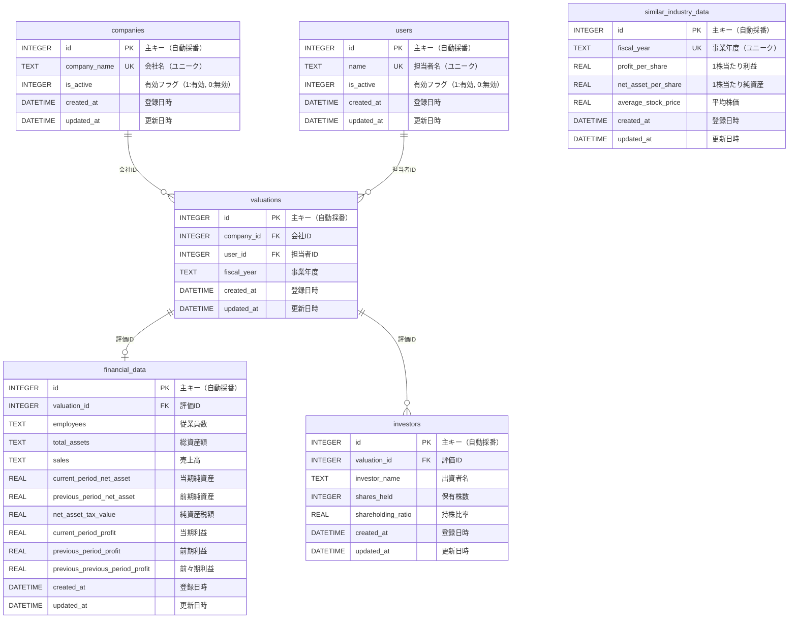

# データベース ER図

## テーブル構成



## テーブル説明

### マスタテーブル

#### 1. companies（会社マスタ）
医療法人などの会社情報を管理するマスタテーブル。

**主な特徴:**
- 会社名はユニーク制約あり
- 論理削除機能あり（`is_active`フィールド）
- 無効化されたデータは画面表示から非表示
- 無効化表示モードで物理削除が可能

#### 2. users（担当者マスタ）
評価担当者の情報を管理するマスタテーブル。

**主な特徴:**
- 担当者名はユニーク制約あり
- 論理削除機能あり（`is_active`フィールド）
- 無効化されたデータは画面表示から非表示
- 無効化表示モードで物理削除が可能

#### 3. similar_industry_data（類似業種データマスタ）
類似業種比準方式で使用する業種データを管理するマスタテーブル。

**主な特徴:**
- 事業年度ごとにユニークなデータを保持
- デフォルト値: 2024年度（令和6年度）のデータが初期登録済み
  - 1株当たり利益: 51
  - 1株当たり純資産: 395
  - 平均株価: 532

### トランザクションテーブル

#### 4. valuations（評価レコード）
評価計算の基本情報を保持するメインテーブル。

**主な特徴:**
- 会社と担当者への外部キー制約あり
- CASCADE削除設定（会社または担当者が削除されると関連評価も削除）

#### 5. financial_data（財務データ）
評価に必要な財務情報を保存するテーブル。

**主な特徴:**
- 評価レコードとの1対1関係
- CASCADE削除設定（評価レコードが削除されると財務データも削除）
- 従業員数、総資産、売上高は文字列型（カンマ区切り表示対応）
- 純資産・利益関連は数値型（計算用）

#### 6. investors（投資家・出資者）
評価対象の出資者情報を管理するテーブル。

**主な特徴:**
- 評価レコードとの1対多関係
- CASCADE削除設定（評価レコードが削除されると出資者データも削除）
- 複数の出資者を登録可能

## リレーションシップ

### 1対多の関係
- `companies` (1) → `valuations` (多): 1つの会社に複数の評価レコード
- `users` (1) → `valuations` (多): 1人の担当者が複数の評価を担当
- `valuations` (1) → `investors` (多): 1つの評価に複数の出資者

### 1対1の関係
- `valuations` (1) → `financial_data` (1): 1つの評価に1つの財務データ

## インデックス

パフォーマンス向上のため、以下のインデックスが設定されています:

```sql
CREATE INDEX idx_valuations_company_id ON valuations(company_id);
CREATE INDEX idx_valuations_user_id ON valuations(user_id);
CREATE INDEX idx_financial_data_valuation_id ON financial_data(valuation_id);
CREATE INDEX idx_investors_valuation_id ON investors(valuation_id);
CREATE INDEX idx_similar_industry_fiscal_year ON similar_industry_data(fiscal_year);
```

## 論理削除機能

`companies`テーブルと`users`テーブルには論理削除機能が実装されています。

### 動作仕様
1. **通常表示**: `is_active = 1`のデータのみ表示
2. **無効化**: 削除ボタンの代わりに無効化ボタンで`is_active = 0`に更新
3. **無効化表示**: トグルボタンで`is_active = 0`のデータも表示
4. **物理削除**: 無効化表示モードでのみ削除ボタンが表示され、物理削除が可能

### メリット
- データの整合性維持
- 誤削除の防止
- 過去データの保持
- 二段階削除によるデータ保護

## データ型

- `INTEGER`: 整数値（主キー、外部キー、フラグなど）
- `TEXT`: 文字列（名前、年度など）
- `REAL`: 浮動小数点数（金額、比率など）
- `DATETIME`: 日時（作成日時、更新日時など）

## 制約

### 主キー制約
全テーブルで`id`カラムが主キー（AUTOINCREMENT）

### 外部キー制約
- `valuations.company_id` → `companies.id` (CASCADE DELETE)
- `valuations.user_id` → `users.id` (CASCADE DELETE)
- `financial_data.valuation_id` → `valuations.id` (CASCADE DELETE)
- `investors.valuation_id` → `valuations.id` (CASCADE DELETE)

### ユニーク制約
- `companies.company_name`: 会社名の重複防止
- `users.name`: 担当者名の重複防止
- `similar_industry_data.fiscal_year`: 事業年度の重複防止

### デフォルト値
- `is_active`: 1（有効状態）
- `created_at`: 現在日時（ローカルタイム）
- `updated_at`: 現在日時（ローカルタイム）

## 更新履歴

- 2024-01-02: `companies`テーブルと`users`テーブルに`is_active`カラムを追加（論理削除機能実装）
