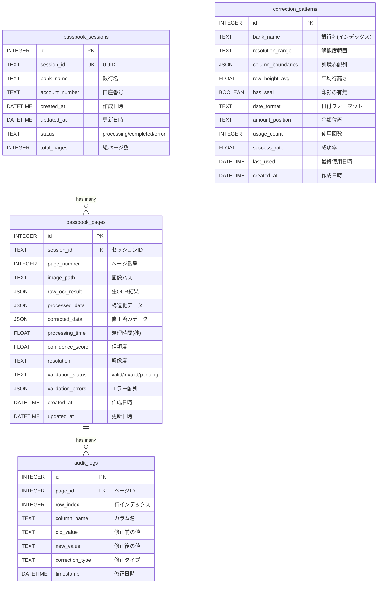

# データベース ER図 (Mermaid)

## エンティティ関連図

## データフロー図

## 処理シーケンス図

## データ変換フロー

## テーブルサイズ推移

## 状態遷移図（validation_status）

## セッション状態遷移図

## クエリ最適化 - インデックス利用

## バックアップ戦略

## データライフサイクル

---

## 使用方法

このMarkdownファイルは、GitHub、GitLab、VS Code（Mermaid拡張機能）などで、
図として自動レンダリングされます。

### VS Codeでの表示方法
1. Mermaid拡張機能をインストール
2. このファイルを開く
3. プレビューモードで表示

### オンラインエディタ
- https://mermaid.live/

---

最終更新: 2025年1月11日
バージョン: 3.1.0
